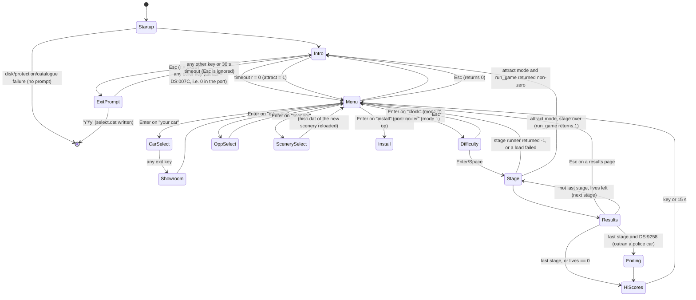

# game_flow — Test Drive II: The Duel, TD2EGA.EXE, segments `0000`–`06b3` and `16fc`

Porting spec for everything outside the driving loop: startup, title screens and credits, the main menu
(GAMEOPT), car / opponent / scenery selection, the showroom, the difficulty screen (GAMEDIFF), the stage
loop around the stage runner, results / gas station / record book, high scores, the police ending, the
pause and exit prompts, and (briefly) the disk and copy-protection code the port drops.

Conventions follow `port/RE_GUIDE.md`: addresses `SSSS:OOOO` as stored in the file, `DS:xxxx` =
image `0x178F0 + xxxx`. File formats already in `FORMATS.md` are cited, not repeated. Every function was
read in `port/decomp/td2ega_ds.c`, and control flow, arithmetic and all string arguments were checked
against the disassembly (`work/flow/all.asm`, made by `work/flow/adis.py`, which labels string
arguments). **Ghidra's string labels in this range point at the wrong strings** (its DGROUP base is off
by 0x40). Use the `DS:xxxx` offsets and the string table in §5.6.

Names of functions owned by other specs (platform, scene_render, simulation) are provisional and
descriptive. They are listed in §2b.

---

## 1. Overview

`main` (0000:07b3) is a C function called from the MS C startup code. It:

1. Initialises the memory manager, picks Hercules (`argv[1] == "herc"`, a plain `strcmp`) or EGA, installs
   the menu key-poll handler, the six Ctrl hotkeys, the keyboard ISR, the 100 Hz timer and the music driver
   tick, and loads `voices.bin` and `songs.bin`. Then it starts song 1 and allocates the 320×200
   off-screen page `DS:8CA2`.
2. Runs the disk-identity check (`diskid.dat`), the copy-protection check, and the catalogue loaders
   (`select.dat`, `cars.dat`, `scenes.dat`, `<scenery>hisc.dat`). The port drops the disk and protection
   parts (§9).
3. Loops forever: **intro sequence** → (Esc: "Exit to DOS (Y/N)?") → **main menu** → back to the intro.

The main menu (019e:06c5) is the GAMEOPT screen with six icons: *race the clock*, *race the computer
car*, *choose your car*, *choose the opponent car*, *choose scenery*, *install*. The two race icons run
**run_game** (0267:15e4). run_game shows the difficulty screen, then loops over the stages of the
selected scenery. Each pass loads that stage's files, calls the stage runner **06c9:1b2c**
(scene_render) and then calls **stage_results** (0267:0039). stage_results shows the gas station (not
after the last stage or a game over), updates the record tables, shows the duel and section screens,
and after the last stage may play the **police ending** (ENDGAME). After the last stage or a game over,
**hisc_check** (0645:06a8) takes the name entry and shows the top-score table.

Attract mode is the flag `DS:8A9A`. It is set when the intro times out, or when a menu times out or F10 is
pressed. In attract mode the menus feed themselves random keys (019e:0004). A random stage is driven with
one life, and control returns to the intro when the stage ends.

All screens are built in the off-screen page `DS:8CA2` and revealed with `screen_reveal`
(0000:0000): an 8-step or 4-step dissolve, `gfx_dissolve` in platform. The text font is the 8×8 ROM-style
font of the platform (`06c9:a530`).

### 1.1 Call graph

```
main 0000:07b3
 ├─ [disk] read_diskid 0000:05c0, check_diskid 0000:0477, copy protection 13a8:002e      (dropped)
 ├─ select_load 0432:02bf, cars_load 0432:00a9, scenes_load 0432:01b2
 ├─ cars_select_by_name 0000:0651, scenery_select_by_name 0000:0730, hisc_load 0645:0000
 ├─ intro_sequence 00c0:039c
 │    ├─ accolade_screen 00c0:027a ── screen_reveal 0000:0000
 │    ├─ showroom_intro 0143:000a ── showroom_drive 0143:01e1 ── showroom_tick 0143:019e (timer routine)
 │    ├─ title_screen 00c0:0004
 │    ├─ credits 010c:0285 ── dsi_logo_screen 010c:000e
 │    └─ hisc_show 0645:0470
 ├─ message_box 0000:0090, "Exit to DOS" prompt (inline), select_save 0432:0376
 ├─ catalog_reload 0432:1d44 (first pass only)
 └─ main_menu 019e:06c5
      ├─ menu_random_key 019e:0004 (attract)
      ├─ run_game 0267:15e4
      │    ├─ difficulty_screen 0267:139b
      │    ├─ [scene_render] stage_run 06c9:1b2c
      │    ├─ stage_results 0267:0039
      │    │    ├─ plural_s 0267:0004, results_line 0267:0017
      │    │    ├─ results_section_page 0267:1224, results_overall 0267:118b
      │    │    ├─ hisc_save 0645:0186
      │    │    └─ police ending (inline, ENDGAME)
      │    └─ hisc_check 0645:06a8 ── hisc_insert 0645:0389 ── name_entry_screen 0645:0271
      │                            └─ hisc_show 0645:0470
      ├─ car_select 019e:027d ── car_slide 019e:009b ; then showroom_drive 0143:01e1
      ├─ scenery_select 019e:0527 ; hisc_load 0645:0000
      └─ install_menu 0432:1ea4 (dropped) ── catalog_reload 0432:1d44
hotkeys (installed by 16fc:0002, run from the key poll): Ctrl-P pause 16fc:0358,
Ctrl-X exit prompt 16fc:007c, Ctrl-S/Ctrl-Q/Ctrl-K message strip 16fc:0220, Ctrl-J joystick calibration 1769:000e
```

### 1.2 Screen flow (verified against `main` 0000:07b3–0c00 and `main_menu` 019e:06c5–0cd0)



Main menu details: each action returns to the menu loop. The menu loop leaves (return 0, back to the
intro) when `DS:007C != 0` (protection failed), or when attract mode is on and run_game returned
non-zero. `install_menu` returns 1 (main exits to DOS without a prompt) if the catalogue ends up with no
cars or no sceneries.

### 1.3 Inside run_game (verified, 0267:15e4–1cb4)

```
difficulty_screen(); Esc -> return 0
"Please wait while loading..." ; stage = 0 ; lives = 5
loop:
    free page DS:8CA2 ; last = (scenes[sel].stages == stage + 1)
    load ROAD, COP, <car>DASH, <car>.BIN ; if duel: <opp>ROAD, <opp>O.BIN
    if attract: lives = 1 ; stage = random
    load <scn><stage>.DAT (packed) ; <scn>CAR1..3 ; the scenery archive named in the .DAT ;
        <scn><stage>.SGN and <scn>.FNT if the .SGN exists
    r = stage_run()          ; 06c9:1b2c, returns DS:5490 (−1 = quit)
    restore 100 Hz timer + music tick ; free everything ; re-allocate page ; song 1
    if any load failed or r == -1: return 0              -> menu
    if attract: return 1                                  -> intro
    stage++
    if lives == 0:  stage_results(99); hisc_check(); return 1
    if last:        if stage_results(1) == Esc return 0; hisc_check(); return 1
    if stage_results(0) == Esc: return 0
```

---

## 2. Function table

### 2a. Functions in this subsystem

| address | proposed name | signature | purpose | confidence |
|---|---|---|---|---|
| 0000:0000 | `screen_reveal` | `int (int mode)` | Copy page `DS:8CA2` to the screen with a dissolve. mode 3: 4 steps of `06c9:8cd8`. Otherwise 8 steps of `06c9:8f12`, polling a key after each step for mode 0/1. mode≠0 first selects the screen as target. Returns key or 0 | verified |
| 0000:0090 | `message_box` | `int (char *msg, int timed)` | Saves screen rows 80..119, black box with outline, msg at y=0x5B and "Press any key to continue." at y=0x65. Waits for a key (timed: 30 s). Returns 0x1B for Esc, else 0 | verified |
| 0000:01b0 | `question_box` | `int (?, char *msg)` | Same box, msg at y=0x60, returns the raw key (install code's y/n questions) | verified |
| 0000:023a | — | — | Not a function: the tail of 0000:01b0 that Ghidra split off | verified |
| 0000:0297 | `ensure_disk` | `int (char *name, int diskType, int mode)` | If `name` is not cached: prompt for the disk of `diskType` and verify its `diskid.dat`. Always sets `DS:8644 = "<drive>:" + name`. 0 = ok, 0x1B = cancelled | verified (dropped) |
| 0000:0477 | `check_diskid` | `int (int diskType, int stamp)` | Reads `<drive>:diskid.dat`: 1 = type matches, 0 = other type, −1 = no file. stamp=1 also checks / writes the master serial | verified (dropped) |
| 0000:05c0 | `read_diskid` | `int (int drive)` | Type index 0..4 of the disk in `drive`, or −1 | verified (dropped) |
| 0000:0651 | `cars_select_by_name` | `void (void)` | Finds the player car `DS:8428` and the opponent car `DS:90B0` in the car table. Defaults: 0 and 1 (0 if only one car) | verified |
| 0000:0730 | `scenery_select_by_name` | `void (void)` | Finds scenery `DS:9212` in the scenery table (default 0) | verified |
| 0000:07b3 | `main` | `void (int argc, char **argv)` | Startup, disk checks, intro/menu loop, exit prompt, shutdown | verified |
| 00c0:0004 | `title_screen` | `int (void)` | Line-art morph (38 lines) from the centre to the logo, then TESTDRV2 `tdri`+`duel` | verified |
| 00c0:027a | `accolade_screen` | `int (void)` | ACCOLADE `acc_`, `pres`, `copy`, then `bull` slides in | verified |
| 00c0:039c | `intro_sequence` | `int (void)` → key / 0 timeout / 0x1B | Preloads DSITITLE, TESTDRV2, ACCOLADE and runs the intro screens in order | verified |
| 010c:000e | `dsi_logo_screen` | `int (void)` | Morphs the TD2 line logo into the DSI line logo, then DSITITLE `sqar`,`text`,`arow`,`type` | verified |
| 010c:0285 | `credits` | `int (void)` | dsi_logo_screen, then the credits text, 5 s | verified |
| 0143:000a | `showroom_intro` | `int (int unused)` | Two cars in the intro: car 0 with its window animation, then car 1 drives across | verified |
| 0143:019e | `showroom_tick` | `void (void)` (timer routine) | Accelerates the showroom car and advances its window frame | verified |
| 0143:01e1 | `showroom_drive` | `int (char *path, int x, int y, int anim, int reveal)` | Showroom: `.SS` window animation, then the car drives off to the left | verified |
| 019e:0004 | `menu_random_key` | `int (void)` | Attract mode: random Up/Down/Enter/Right/Left/Esc/none | verified |
| 019e:009b | `car_slide` | `far* (int car, int from, int to, far* oldArchive)` | Slides the new car image vertically into the top 88 rows, then draws `stat` | verified |
| 019e:027d | `car_select` | `int (int car)` → car | Car selection screen (Up/Down), returns the chosen index | verified |
| 019e:0527 | `scenery_select` | `void (void)` | Scenery selection (icon `picl`), any direction changes the scenery | verified |
| 019e:06c5 | `main_menu` | `int (void)` → 0 back to intro, 1 exit | GAMEOPT menu and the action dispatch | verified |
| 0267:0004 | `plural_s` | `char* (int n)` | `""` if n == 1 else `"s"` (DS:7738 / DS:7739) | verified |
| 0267:0017 | `results_line` | `void (char *s, int x)` | If s is not empty: draw at (x, `DS:83D2`), then `DS:83D2 += 8` | verified |
| 0267:0039 | `stage_results` | `int (int kind)` kind 0 = normal, 1 = last stage, 99 = game over → key | Gas station, scoring, record book, duel and section screens, police ending | verified |
| 0267:118b | `results_overall` | `void (void)` | " Overall Performance " with the game time and score | verified |
| 0267:1224 | `results_section_page` | `void (void)` | Clears the page and draws two boxes, " Section n ", the distance, and the stage time/speed/score | verified |
| 0267:139b | `difficulty_screen` | `int (void)` → 0 / 0x1B | GAMEDIFF: 12-position scale that sets `DS:922E`, `DS:920C`, `DS:8432`, `DS:90A8` | verified |
| 0267:15e4 | `run_game` | `int (int mode)` → 0 menu, 1 intro/finished | Stage loop (§1.3) | verified |
| 0432:0006 | `name_to_field` | `void (char *dst, char *src)` | Copy, trim trailing spaces (from index 17), spaces → `_` (writing cars/scenes.dat) | verified (install) |
| 0432:0061 | `field_to_name` | `void (char *s)` | `_` → space, pad with spaces to 18 characters | verified |
| 0432:00a9 | `cars_load` | `int (int diskType, int flag)` | Appends `cars.dat` records to the car table. 0 ok, 0x1B error | verified |
| 0432:01b2 | `scenes_load` | `int (int diskType, int flag)` | Appends `scenes.dat` records to the scenery table | verified |
| 0432:02bf | `select_load` | `int (int diskType)` | Reads `select.dat` (defaults if missing). 0x1B only if the disk prompt was cancelled | verified |
| 0432:0376 | `select_save` | `void (int diskType)` | Writes `select.dat` | verified |
| 0432:040f | `install_draw_drive` | `void (int type, int y, int fg, int bg)` | Draws the drive name `DS:039C + 5*drive` at x=0xE6 | verified (dropped) |
| 0432:0441 | `install_edit_drive` | `void (int type, int y)` | Arrows change `DS:8A1C[type]` until Enter/Esc/timeout | verified (dropped) |
| 0432:04f1 | `copy_queued_files` | `int (void)` | Copies up to 20 queued files (names `DS:9268+21i`) to the PLAY disk, buffering in memory | likely (dropped) |
| 0432:0847 | `playdisk_create_file` | `int (char *name)` | Creates an empty file on the PLAY disk | likely (dropped) |
| 0432:088f | `playdisk_delete_file` | `void (char *name)` | "Deleting %s", `unlink` | likely (dropped) |
| 0432:08f5 / 0a2e / 0b66 | `install_list_*` | | Draw the car / scenery pick lists of the copy menus | guess (dropped) |
| 0432:0c0e | `make_play_disk` | `int (void)` | Writes PLAY `diskid.dat`, empty `cars.dat`, `scenes.dat` | likely (dropped) |
| 0432:0d35 / 0f71 | `copy_car_files` / `copy_scenery_files` | `int (int idx)` | Queues `<code>*.*` and appends a line to cars.dat / scenes.dat | likely (dropped) |
| 0432:11ae / 1341 | `delete_car_files` / `delete_scenery_files` | `int (int idx)` | "Are you sure…", deletes the files, rewrites the .dat | likely (dropped) |
| 0432:14db / 19d8 | `copy_cars_menu` / `copy_scenery_menu` | `int (void)` | "C O P Y   C A R S" / "S C E N E R Y" menus (V shows the car) | likely (dropped) |
| 0432:1d25 | `forget_play_disk` | `void (void)` | `DS:0040[DS:8A22]=0; DS:8A22=0; DS:8A8C=0; DS:8A1C=DS:8C9E` | verified (dropped) |
| 0432:1d44 | `catalog_reload` | `int (void)` | If `DS:90B6`: reload cars/scenes from the data disk plus the extra CAR/SCENERY disks (each protection-checked), reselect, reload hisc | verified |
| 0432:1ea4 | `install_menu` | `int (void)` | "I N S T A L L   M E N U" (7 items, jump table 0432:211a) | likely (dropped) |
| 0645:0000 | `hisc_load` | `int (void)` | Reads `<scn>hisc.dat` and checks its checksum. Clears the tables on a mismatch or a missing file | verified |
| 0645:0186 | `hisc_save` | `void (void)` | Recomputes the checksum and writes 0x154 bytes | verified |
| 0645:0271 | `name_entry_screen` | `int (void)` | "You have qualified…" with `logL` and name input into `DS:9218` | verified |
| 0645:0389 | `hisc_insert` | `int (void)` | Inserts `DS:8420` into the top-6 list | verified |
| 0645:0470 | `hisc_show` | `int (long timeout)` | "THE DUEL: TEST DRIVE II TOP SCORES" table | verified |
| 0645:06a8 | `hisc_check` | `int (void)` | If the score qualifies and not attract: insert. Then show the table for 15 s | verified |
| 06b3:0008 | — | | Steering/physics helper called from 06c9:420a. **See simulation** | verified (not flow) |
| 16fc:0002 | `hotkeys_install` | `void (void)` | Registers Ctrl-J/K/P/Q/S/X handlers (06c9:645a/646f/6508/64c7/6488/6518) | verified |
| 16fc:007c | `exit_prompt` | `void (void)` | "EXIT TO DOS (Y/N)" box, 'Y' → restore hardware and `exit(0)` | verified |
| 16fc:0220 | `status_strip` | `void (char *msg, long ticks)` | Shows msg in the bottom 10 rows for `ticks` (06c9:c6c5 timer), then restores them | verified |
| 16fc:0358 | `pause_prompt` | `void (void)` | "PAUSE - PRESS ANY KEY TO RESUME" box until a key | verified |

### 2b. External functions used here (owned by other specs; names provisional)

| address | name used here | signature (as used) | notes |
|---|---|---|---|
| 06c9:1b2c | `stage_run` | `int (void)` | scene_render. Loops the frame routines until `DS:5490 ≠ 0`, handles crash/engine/gas/etc. codes via the table `DS:2302`, sets `DS:5374`/`5376` (distances), `DS:942E` (time). Returns `DS:5490` sign-extended; −1 = quit. **Protection:** byte 06c9:1bf7 is `CLC` in the file and becomes `RETF` when the check passes (§9.3) |
| 06c9:5d00 | `nop` | | `RETF` stub |
| 06c9:5d01 | `far_memcpy` | `(src far, dst far, n)` | |
| 06c9:5d2e | `make_serial` | `char* ()` | BIOS time → 4 bytes with bit 7 set (DS:52C2) |
| 06c9:5d4e / 5d74 | `dos_num_drives` / `bios_num_floppies_plus1` | | int 21h/0Eh; int 11h |
| 06c9:5d5b | `dos_set_readonly` | `(name)` | int 21h/4301h, CX=2 (hidden) |
| 06c9:5d83 / 5d8d | `bios_ticks` / `bios_ticks_since` | | 0040:006C |
| 06c9:5dfb | `gfx_set_clip` | `(x0Bytes, x1Bytes, y0, y1)` | x in bytes (×8 px) |
| 06c9:5ef4 | `dos_findfirst` | `char* (name)` | Returns the path of the match or 0 |
| 06c9:5f64 / 5fbc | `herc_init` / `herc_shutdown` | | |
| 06c9:6059 | `timer_set_rate` | `(divisor)` | `0x2E9C` → 100.0 Hz |
| 06c9:610a | `timer_restore` | | |
| 06c9:614c / 6180 | `timer_add_routine` / `timer_remove_routine` | `(far fn)` | 5 slots at DS:5F12 |
| 06c9:642e | `video_restore` | | text mode |
| 06c9:6585 | `hotkey_set` | `(code, far fn)` | table DS:6048 |
| 06c9:65c5 | `menu_key_poll` | `int ()` | BIOS key through the hotkey filter 06c9:6528. With no key: joystick (06c9:6686), button → 0x0D, direction → table DS:6254 (1 Up 0x4800, 2 Down 0x5000, 4 Right 0x4D00, 8 Left 0x4B00, diagonals PgUp/PgDn/Home/End), edge-triggered via DS:6274 |
| 06c9:6860 / 68c4 | `kbd_install` / `kbd_restore` | | int 9 hook |
| 06c9:69fe | `key_poll` | `int ()` | Calls the handler in DS:64DC (set by 06c9:6a17, read by 6a28) |
| 06c9:6a03 | `bios_key_poll` | | Raw int 16h (used while a prompt is shown) |
| 06c9:6a30 | `wait_key` | `int ()` | Loops key_poll until non-zero |
| 06c9:6a3b | `kbd_flush` | | |
| 06c9:6a4a | `wait_deadline_or_key` | `int ()` | Key or 0 when the deadline of 06c9:7a10 passes |
| 06c9:6a6a | `wait_key_timeout` | `int (long ticks)` | Key or 0 after `ticks` |
| 06c9:6aa2 | `file_read_all` | `far (name, far buf)` | Fatal "%s FILE ERROR" if missing |
| 06c9:6d18 | `load_file` | `far (name)` | Raw file, cached by name |
| 06c9:6d50 | `load_packed_file` | `far (name)` | Unpacks (FORMATS.md "Packed files") |
| 06c9:6e59 | `res_find` | `far (archive far, char *name4)` | Fatal if missing |
| 06c9:6f86 | `mem_init` | | Memory manager below A000h |
| 06c9:7273 | `res_is_cached` | `int (name)` | |
| 06c9:72c6 / 736b | `mem_release` / `mem_release2` | `(far)` | Both release a block. The data can stay cached by name (platform) |
| 06c9:758a / 75c8 | `song_start` / `voices_set` | `(far songs, n)` / `(far voices)` | Songs used: 1 title/menu, 2 and 3 ending |
| 06c9:780e | `rand8` | `int ()` | 0..255 |
| 06c9:782c | `page_free` | `(far page)` | |
| 06c9:7866 / 7874 | `file_write` | `(name, far buf, long size)` | int 21h/3Ch/40h |
| 06c9:78f8 / 7918 | `gfx_state_save` / `gfx_state_restore` | `(buf[52])` | target + clip |
| 06c9:7a10 | `deadline_set` | `(long ticks)` | DS:6818 |
| 06c9:7a27 | `deadline_wait` | | |
| 06c9:7a55 | `delay_ticks` | `(long ticks)` | Busy wait, no key check |
| 06c9:7a82 | `text_colours` | `(fg, bg)` | DS:6820/6822 |
| 06c9:7aa4 / 7abd | `text_state_save/restore` | `(buf[22])` | |
| 06c9:7d5e | `gfx_set_target` | `(far desc)` | `06c9:af54` = screen |
| 06c9:843e | `gfx_fill_clip` | `(colour)` | Fills the current clip rectangle |
| 06c9:8582 | `gfx_draw_line` | `(x0,y0,x1,y1,colour)` | colour 0xFFFF |
| 06c9:8a0c | `gfx_fill_rect` | `(x,y,w,h,colour)` | |
| 06c9:8cd8 / 8f12 | `gfx_dissolve4_step` / `gfx_dissolve8_step` | `(far page, step)` | |
| 06c9:90e8 | `gfx_init_ega` | | |
| 06c9:916c / 91a4 / 91d6 | `blit_hot` / `blit_at` / `blit_own` | `(spr far[, x, y])` | Opaque, family A (core 06c9:9189, clipped: used with band clips) |
| 06c9:9c58 / 9c90 / 9cc2 | `blit2_hot` / `blit2_at` / `blit2_own` | same | Opaque, family B (core 06c9:9c75); used for full-page copies |
| 06c9:7d7c, 808a / 80aa / 80ca | `blit_mask_hot`, `blit2_mask_hot` / `_at` / `_own` | same | Mode byte 8 (AND mask) |
| 06c9:a6d8 / a718, a9d2 / a9f2 / aa12 | `blit_or_hot` / `_own`, `blit2_or_hot` / `_at` / `_own` | same | Mode byte 0x10 (transparent/OR) |
| 06c9:a530 | `draw_text` | `(char*, x, y)` | |
| 06c9:ac40 | `grab_screen_into` | `(far page, x, y)` | |
| 06c9:ae62 | `gfx_scroll_window` | `(x, y0, wBytes, h, rowDelta, far spr, srcRow)` | EGA write-mode-1 one-row scroll (±40 bytes = one row), then copies row `srcRow` of `spr` into the freed row |
| 06c9:b0fe | `page_alloc` | `far (w, h, planes)` | |
| 06c9:c6c5 | `delay_ticks2` | `(long)` | Uses the 06c9:c692 counter |
| 06c9:c784 | `grab_rect` | `(x, y, dx, dy, w, h)` | Screen → current target |
| 13a8:002e | `copyprot_check` | `int ()` | Disk-key protection, **CRT segment but not CRT** (§9.3) |
| 13a8:0978 / 0a6e / 0a9c / 0ae0 | `fclose` / `fopen` / `fprintf` / `fscanf` | | MS C |
| 13a8:0582 | `exit` | | |
| 13a8:2916 / 2956 / 2988 / 29b4 / 2a3c / 2a96 / 2b40 | `strcat` / `strcpy` / `strcmp` / `strlen` / `sprintf` / `sscanf` / `stricmp` | | 2b40 folds case |
| 13a8:2e20 / 2e2e | `unlink` / `getdrive` | | int 21h/41h, 19h (+1) |
| 13a8:2e42 / 2ee8 / 2f1c / 2fc4 | `_aldiv` / `_almul` / `_alrem` / `_alshl` | `long (long a, long b)` callee pops | |
| 16a7:0002 | `fatal` | `(fmt, …)` | Restores hardware, prints, exits |
| 16aa:0002 | `toupper` | | |
| 16ab:000c | `draw_text_centered` | `(char*, y)` | x = targetWidth/2 − 4·strlen (target width = word CS:AF52) |
| 16af:0006 | `draw_box` | `(x0,y0,x1,y1,colour)` | 4 × fill_rect |
| 16b8:0000 | `findfirst_count` | `(pattern, n)` | Install code |
| 16bb:02a8 | `text_input` | `(buf, len, x, y, long timeout)` | Fills buf with `len` spaces, then line editor 16bb:000a |
| 16eb:000a | `res_find_list` | `(archive, char *names, far out[])` | Concatenated 4-char names |
| 1748:000e | `load_archive` | `far (char *name)` | Appends `.PES`, loads, UNFLIPs, cached by name |
| 1769:000e | `joy_calibrate` | | |

---

## 3. Globals

"flow" = functions in this spec. Values not written by flow come from simulation / scene_render.

| DS offset | proposed name | type | meaning | written by | read by |
|---|---|---|---|---|---|
| DS:0040 | `drive_disk_type` | u16[] by drive (1-based) | type+1 of the disk known to be in each drive | main, ensure_disk, forget_play_disk | ensure_disk |
| DS:004E | `disk_id_codes` | char[5]×5 | Obfuscated disk IDs, 4 bytes + NUL: MASTER `CE CF CE D1`, CAR `C3 C4 C5 B4`, SCENERY `C7 D7 D2 B6`, PLAY `D4 CE CA B8`, PROGRAM `E0 E1 E2 E3` | const | read/check_diskid |
| DS:0068 | `disk_type_names` | char*[5] | "MASTER","CAR","SCENERY","PLAY","PROGRAM" | const | prompts, scenery_select |
| DS:0072 | `master_serial` | char[] | Serial from diskid.dat | check_diskid | check_diskid |
| DS:007C | `protect_failed` | u16, init **1** | 0 = protection passed. 1 forces attract mode and bails out of the menu | main | main, main_menu |
| DS:007E | `logo_lines_a` | s16[38×4] | x0,y0,x1,y1 of the title line logo | const | title_screen, dsi_logo_screen |
| DS:01AE | `logo_lines_b` | s16[38×4] | DSI line logo | const | dsi_logo_screen |
| DS:02DE | `showroom_speed` | s16 | 0..200 | showroom_drive, showroom_tick | tick |
| DS:02E0 | `showroom_dist` | s16 | pixels travelled | same | showroom_drive |
| DS:02E2 | `menu_sel` | s16, init 0 | 0 clock, 1 computer, 2 your car, 3 other car, 4 scenery, 5 install | main_menu | main_menu |
| DS:02E4 | `difficulty` | s16 0..11, init 0 | GAMEDIFF position | difficulty_screen | same, 06c9:1c8f |
| DS:02E6 | `gas_attendant` | char*[10] | kevn brad bruc donm tres blah lavn rand tony john (GASSTUFF sprite per stage) | const | stage_results |
| DS:02FA | `rating_msgs` | char*[4×3×2] | index `rating*12 + variant*4` (+2 = second line) | const | stage_results |
| DS:032A / 0350 / 0376 | `end_guy_frame2` / `end_cop_frame2` / `end_frame_ticks` | s16[19] | Ending animation tables (§4.14) | const | stage_results |
| DS:039C | `drive_names` | char[5]×7 | "none","A:  ".."F:  " | const | install |
| DS:0504 | `install_items` | char*[7] | Exit, Car Disk, Scenery Disk, Play Disk, Make Play Disk, Copy Cars, Copy Scenery | const | install_menu |
| DS:23A6 | `car_bin` | u8[0x34F] | Player `<car>.BIN` | run_game | simulation |
| DS:331C | `opp_penalties` | s16 | Opponent crash count (stage) | simulation | stage_results |
| DS:346A | `stage_dat` | u8[0x1E5E] | Unpacked `<scn><n>.DAT`. Starts with the scenery archive name (NUL-terminated) | run_game | run_game, simulation |
| DS:379E | `stage_score_k` | s16 | Score factor (stage .DAT +0x334) | .DAT | stage_results |
| DS:37A0/37A2/37A4 | `rating_speed1/2/3` | s16 | Average-mph thresholds for the rating message | .DAT | stage_results |
| DS:380F | `stage_length` | s16 | Stage length, units of 1/420 mile | .DAT | stage_results, section page |
| DS:536C / 536E / 5370 | `crashes` / `engines_blown` / `tickets` | s16 | Stage incident counts | simulation | stage_results |
| DS:5372 | `opp_time` | s16 | Opponent time (0.1 s). Rewritten by stage_results without penalties | simulation, stage_results | stage_results |
| DS:5374 / 5376 | `player_dist` / `opp_dist` | s16 | Distance driven this stage (1/420 mile), set by stage_run | stage_run, stage_results | stage_results |
| DS:5490 | `stage_end_code` | s8 | scene_render | | stage_run |
| DS:5616 | `opp_bin` | u8[0x20] | `<opp>O.BIN` | run_game | simulation |
| DS:5656 | `protect_sabotage` | u8 | 0x63 until the protection passes, then 0 (written through segment 1793h = DGROUP+4) | 13a8:0163/0189 | main_menu |
| DS:5657 | `protect_drive` | u8 | Drive for the protection check (0 = A:) | main, catalog_reload | 13a8:007e |
| DS:83C8 / 83CA / 83CC / 83CE | `ss_ticks` / `ss_frame_ticks` / `ss_frame` / `ss_frames` | s16 | `.SS` animation state | showroom | showroom_tick |
| DS:83D0 | `menu_prev_sel` | s16 | Redraw trigger | main_menu | main_menu |
| DS:83D2 | `results_y` | s16 | Text cursor y of results_line | results | results |
| DS:8420 | `total_score` | s32 | Game score | run_game, stage_results | hisc |
| DS:8424 | `lives` | s16 | 5 at start, +1 per gas station | run_game, stage_results, simulation | |
| DS:8426 | `first_hd_drive` | s16 | floppies+1: drives below it are floppies | main | ensure_disk |
| DS:8428 | `player_car_code` | char[] | e.g. "F40" | select_load, menu | everywhere |
| DS:842E | `scn_font` | far | `<scn>.FNT` (0 if the stage has no .SGN) | run_game | scene_render |
| DS:8432 | `diff_c` | s16 | 90..180 | difficulty_screen | simulation |
| DS:8434 | `opp_total_score` | s32 | | stage_results | |
| DS:8438 | `avg_speed` | s32 | Player mph this stage | stage_results | |
| DS:843C | `ncars_main` | s16 | Car count before extra car disks | main, catalog_reload | showroom_intro |
| DS:843E | `game_mode` | s16 | 0 clock, 1 duel | run_game | stage_results, simulation |
| DS:8640 | `songs` | far | songs.bin | main | |
| DS:8644 | `disk_path` | char[] | `"X:" + name` built by ensure_disk | ensure_disk | all loaders |
| DS:8658 | `out_of_gas` | s16 | Count (stage_run 06c9:1c2a) | stage_run | stage_results |
| DS:865A | `stage` | s16 | 0-based, incremented after the stage | run_game | everywhere |
| DS:865C | `scenery_table` | 32-byte records (§5.2) | | scenes_load | |
| DS:8A1C | `drive_of_type` | s16[5] | Drive per disk type: MASTER, CAR, SCENERY, PLAY, PROGRAM | main, select_load (8A1E..8A22), install | |
| DS:8A76/8A7C/8A84 | `scn_car1..3` | far | `<scn>CAR1..3` | run_game | scene_render |
| DS:8A7A | `ncars` | s16 | | cars_load | |
| DS:8A80 / 8A82 / 9264 | `scn_disk` / `car_disk` / `opp_disk` | s16 | Disk type holding the selection | | |
| DS:8A8C | `data_disk` | s16 | Disk type of the game data (0 MASTER, 3 PLAY, 4 PROGRAM) | main | |
| DS:8A8E / 8A92 / 8A96 | `road_arc` / `dash_arc` / `cop_arc` | far | ROAD, `<car>DASH`, COP | run_game | scene_render |
| DS:8A9A | `attract` | s16 | Demo mode | main, menus | many |
| DS:8C9E | `start_drive` | s16 | | main | |
| DS:8CA2 | `page` | far | 320×200 4-plane off-screen page (freed during a stage) | main, run_game | all screens |
| DS:8CF6 | `opp_total_time` | s16 | | stage_results | |
| DS:8CF8 | `penalties` | s16 | crashes + engines + out_of_gas | stage_results | section page |
| DS:8CFA / 8CFE / 9266 | `scn_idx` / `opp_idx` / `car_idx` | s16 | Table indices | | |
| DS:8CFC | `boot_disk_type` | s16 | Type of the start-up disk | main | |
| DS:8D00 | `gameopt_spr` | far[9] | cloc comp ycar ocar scen inst txt0 txt1 arrw | main_menu | |
| DS:8D24 | `car_table` | 30-byte records (§5.1) | | cars_load | |
| DS:90A8 | `diff_easy` | s16 | difficulty < 4 and not attract | difficulty_screen | simulation |
| DS:90AA | `nscenes` | s16 | | scenes_load | |
| DS:90AC | `opp_stage_score` | s32 | | stage_results | |
| DS:90B0 | `opp_car_code` | char[] | | select_load, menu | |
| DS:90B6 | `catalog_dirty` | s16 | | main, install | catalog_reload |
| DS:90B8 | `hisc_block` | u8[0x154] | File image of hisc.dat (§5.4) | hisc_* , stage_results | |
| DS:920C | `diff_b` | s16 | 127..255 | difficulty_screen | 06c9:1e59 |
| DS:9210 | `total_time` | s16 | Game time, 0.1 s | stage_results | |
| DS:9212 | `scn_code` | char[] | e.g. "TDS2" | | |
| DS:9218 | `player_name` | char[16] | | name entry | hisc |
| DS:9228 | `opp_road_arc` | far | `<opp>ROAD` | run_game | scene_render |
| DS:922C | `num_drives` | s16 | | main | |
| DS:922E | `diff_score_pct` | s16 | 33..100 | difficulty_screen | stage_results, simulation |
| DS:9258 | `outran_police` | u8/u16 | Set by simulation 06c9:5844, cleared by run_game | | stage_results |
| DS:925C | `stage_score` | s32 | | stage_results | |
| DS:9260 | `scenery_arc` | far | Archive named by the stage .DAT | run_game | scene_render |
| DS:940C | `stage_sgn` | far | `<scn><n>.SGN` or 0 | run_game | scene_render |
| DS:9410 | `last_stage` | s16 | | run_game | stage_results, simulation |
| DS:9412 | `opp_avg_speed` | s32 | | stage_results | |
| DS:9416 | `diskid_buf` | char[] | | disk code | |
| DS:942A | `voices` | far | voices.bin | main | |
| DS:942E | `stage_time` | s16 | 0.1 s, from stage_run. Rewritten by stage_results | | |

---

## 4. Pseudocode

Common helpers used below:

```c
#define SCREEN      ((far)0x06C9AF54)            /* screen descriptor */
#define KEY_ESC 0x1B, KEY_ENTER 0x0D, KEY_SPACE 0x20
#define KEY_UP 0x4800, KEY_DOWN 0x5000, KEY_LEFT 0x4B00, KEY_RIGHT 0x4D00, KEY_F10 0x4400
/* timer: 100 Hz (divisor 0x2E9C), all tick counts below are 1/100 s */
```

### 4.1 main — 0000:07b3 (verified)

```c
void main(int argc, char **argv)
{
    int prompted = 0, herc = 0; u16 t0, elapsed;
    mem_init();                                   /* 06c9:6f86 */
    t0 = bios_ticks();
    if (strcmp(argv[1], "herc") == 0) { herc_init(); herc = 1; } else gfx_init_ega();
    key_handler = menu_key_poll;                  /* 06c9:6a17(06c9:65c5) */
    hotkeys_install();                            /* 16fc:0002 */
    kbd_install();                                /* 06c9:6860 */
    timer_set_rate(0x2E9C);                       /* 100 Hz */
    timer_add_routine(0x06C9_75EA);               /* music/sound driver tick */
    voices = load_file("voices.bin"); songs = load_file("songs.bin");
    voices_set(voices); song_start(songs, 1);
    page = page_alloc(320, 200, 0x0F);

    /* ---- disk identity + protection (port: replace, see 9) ---- */
    getdrive(&drv); start_drive = drv;
    t = read_diskid(drv);
    if (t != 4 && t != 0) goto shutdown;          /* must boot from MASTER or PROGRAM disk */
    boot_disk_type = t; drive_disk_type[drv] = t + 1; drive_of_type[t] = drv; drive_of_type[0] = drv;
    if (check_diskid(t, 1) != 1) goto shutdown;
    protect_drive = drv - 1; protect_failed = copyprot_check();
    num_drives = dos_num_drives(); first_hd_drive = bios_num_floppies_plus1() + 1;
    for (t = -1, d = first_hd_drive; d <= num_drives; d++)      /* look for a PLAY disk on a hard disk */
        if ((t = read_diskid(d)) == 3) break;
    elapsed = bios_ticks_since(t0);
    for (;;) {
        if (t != 3) {                                             /* 0x959 */
            while (!(f = fopen("testdrv2.pes", "r")))
                if (message_box("Please insert MASTER or PLAY Disk.", 0)) goto shutdown;
            fclose(f); getdrive(&drv); t = read_diskid(drv); boot_disk_type = t;
            drive_disk_type[drv] = t + 1; drive_of_type[t] = drv;
            protect_drive = check_diskid(t, 1) - 1;               /* sic, 0x9CF..0x9FC */
            protect_failed = copyprot_check();
        }
        t0b = bios_ticks();
        data_disk = t; drive_disk_type[drv] = t + 1; drive_of_type[t] = drv;
        if (select_load(data_disk)) goto shutdown;
        ncars = 0; nscenes = 0;
        cars_load(data_disk, 1);
        if (ncars != 0) { scenes_load(data_disk, 1); if (nscenes != 0) break; }
        if (data_disk == boot_disk_type) goto shutdown;
        forget_play_disk(); t = 0;                                /* retry with the MASTER disk */
    }
    ncars_main = ncars;
    cars_select_by_name(); scenery_select_by_name();
    if (hisc_load()) goto shutdown;
    elapsed += bios_ticks_since(t0b);

    for (;;) {                                                     /* 0xAB9 */
        r = intro_sequence();
        if (r == KEY_ESC) {
            gfx_fill_rect(0x28, 0x50, 0x118, 0x28, 0);
            draw_box(0x28, 0x50, 0x117, 0x77, 0xFFFF);
            text_colours(15, 0);
            draw_text_centered("Exit to DOS (Y/N)?", 0x60);
            do r = wait_key_timeout(3000); while (r == KEY_ESC);   /* Esc is ignored */
            if (r == 'y' || r == 'Y') { select_save(data_disk); goto shutdown; }
            continue;
        }
        attract = (r == 0) ? 1 : protect_failed;
        if (!prompted) {
            if ((drive_of_type[1] || drive_of_type[2]) && select_load(data_disk)) goto shutdown;
            if (drive_of_type[3] && boot_disk_type != 3) {
                if (select_load(3) == 0) data_disk = 3; else forget_play_disk();
            }
            catalog_dirty = 1;
            if (catalog_reload()) goto shutdown;
            prompted = 1;
        }
        if (elapsed > 500) protect_failed = 1;                     /* unsigned compare; ~27 s */
        if (main_menu()) goto shutdown;
    }
shutdown:
    timer_restore(); kbd_restore();
    if (herc) herc_shutdown(); else video_restore();
}
```

### 4.2 screen_reveal — 0000:0000 (verified)

```c
int screen_reveal(int mode)
{
    if (mode) gfx_set_target(SCREEN);
    if (mode == 3) { for (i = 0; i < 4; i++) gfx_dissolve4_step(page, i); return 0; }
    for (i = 0; i < 8; i++) {
        gfx_dissolve8_step(page, i);
        if ((mode == 1 || mode == 0) && (k = key_poll())) return k;
    }
    return 0;
}
```

### 4.3 message_box — 0000:0090 (verified); question_box 0000:01b0 is the same with msg at y=0x60, no second line, `wait_key()` and the raw key returned

```c
int message_box(char *msg, int timed)
{
    char st[52]; gfx_state_save(st); gfx_set_target(SCREEN);
    far save = page_alloc(320, 40, 15);
    grab_screen_into(save, 0, 0x50);
    gfx_fill_rect(0, 0x50, 320, 40, 0);
    draw_box(0, 0x50, 0x13F, 0x77, 0xFFFF);
    text_colours(15, 0);
    draw_text_centered(msg, 0x5B);
    draw_text_centered("Press any key to continue.", 0x65);
    k = timed ? wait_key_timeout(3000) : wait_key();
    blit2_at(save, 0, 0x50); page_free(save); gfx_state_restore(st);
    return (k == KEY_ESC || k == 0) ? k : 0;
}
```

### 4.4 Catalogue — 0432:00a9, 01b2, 02bf, 0376; 0000:0651, 0730 (verified)

```c
int cars_load(int disk, int flag)
{
    if (ensure_disk("cars.dat", disk, 0)) return 0x1B;
    FILE *f = fopen(disk_path, "r");
    if (!f) { message_box("Cannot open cars.dat for read.", 0); return 0x1B; }
    while (!feof(f) && ncars < 31) {                /* 31 entries overflow into DS:90A8.., see 8 */
        car_t *c = &car_table[ncars];
        fscanf(f, "%s %s", c->code, c->name);
        if (c->code[0] == 0) break;
        if (ncars && flag) for (i = 0; i < ncars; i++) stricmp(c->code, car_table[i].code); /* result unused */
        c->disk = disk; c->flag = 0;
        field_to_name(c->name);                    /* '_' -> ' ', pad to 18 */
        ncars++;
    }
    fclose(f); return 0;
}
/* scenes_load: same with "scenes.dat", "%s %s %d" -> code, name, stages;
   message "Cannot open scenes.dat for read."; the count is incremented after the
   empty-code check, so a blank line ends the list. */

int select_load(int disk)
{
    if (ensure_disk("select.dat", disk, 0)) return 0x1B;
    FILE *f = fopen(disk_path, "r");
    if (!f) { drive_of_type[1] = drive_of_type[2] = drive_of_type[3] = 0;
              strcpy(player_car_code, "F40"); strcpy(opp_car_code, "P959"); strcpy(scn_code, "TDS2"); }
    else  { fscanf(f, "%d %d %d %s %s %s", &drive_of_type[1], &drive_of_type[2], &drive_of_type[3],
                   player_car_code, opp_car_code, scn_code); fclose(f); }
    return 0;
}

void select_save(int disk)
{
    r = (disk == 3) ? ensure_disk("select.dat", 3, 1) : ensure_disk("select.dat", disk, 0);
    if (r) return;
    FILE *f = fopen(disk_path, "w");
    if (!f) { message_box("Cannot open select.dat for write", 0); return; }
    fprintf(f, "%d %d %d %s %s %s", drive_of_type[1], drive_of_type[2], drive_of_type[3],
            player_car_code, opp_car_code, scn_code);
    fclose(f);
}

void cars_select_by_name(void)
{
    car_idx = opp_idx = -1;
    for (i = 0; i < ncars; i++) {                  /* last match wins */
        if (stricmp(car_table[i].code, player_car_code) == 0) car_idx = i;
        if (stricmp(car_table[i].code, opp_car_code) == 0)    opp_idx = i;
    }
    if (car_idx < 0) car_idx = 0;
    strcpy(player_car_code, car_table[car_idx].code); car_disk = car_table[car_idx].disk;
    if (opp_idx < 0) opp_idx = (ncars < 2) ? 0 : 1;
    strcpy(opp_car_code, car_table[opp_idx].code);   opp_disk = car_table[opp_idx].disk;
}

void scenery_select_by_name(void)
{
    scn_idx = -1;
    for (i = 0; i < nscenes; i++) if (stricmp(scenery_table[i].code, scn_code) == 0) scn_idx = i;
    if (scn_idx < 0) { strcpy(scn_code, scenery_table[0].code); scn_idx = 0; }
    strcpy(scn_code, scenery_table[scn_idx].code); scn_disk = scenery_table[scn_idx].disk;
}
```

`catalog_reload` 0432:1d44 (verified; port: reduce to "select by name + hisc_load"):

```c
int catalog_reload(void)
{
    for (;;) {
        if (!catalog_dirty) return 0;
        ncars = nscenes = 0;
        if (cars_load(data_disk, 1))   { if (data_disk == boot_disk_type) return 1;
                                         forget_play_disk(); if (cars_load(data_disk, 1)) return 1; }
        ncars_main = ncars;
        if (scenes_load(data_disk, 1)) { if (data_disk == boot_disk_type) return 1;
                                         forget_play_disk(); if (scenes_load(data_disk, 1)) return 1; }
        if (ncars && nscenes) break;
        if (data_disk == boot_disk_type) return 1;
        message_box("Play Disk needs both cars and scenery!", 0); forget_play_disk();
    }
    if (drive_of_type[1]) {                        /* extra CAR disk: appended, protection-checked */
        if (cars_load(1, 1) == 0) { protect_drive = drive_of_type[1] - 1;
                                    if (copyprot_check() == 0) goto cars_ok; ncars = ncars_main; }
        drive_disk_type[drive_of_type[1]] = 0; drive_of_type[1] = 0;
    }
cars_ok:
    if (drive_of_type[2]) {                        /* extra SCENERY disk */
        n = nscenes;
        if (scenes_load(2, 1) == 0) { protect_drive = drive_of_type[2] - 1;
                                      if (copyprot_check() == 0) goto scn_ok; }
        nscenes = n; drive_disk_type[drive_of_type[2]] = 0; drive_of_type[2] = 0;
    }
scn_ok:
    cars_select_by_name(); scenery_select_by_name(); hisc_load();
    catalog_dirty = 0; return 0;
}
```

### 4.5 intro_sequence — 00c0:039c and the intro screens (verified)

```c
int intro_sequence(void)
{
    if ((r = key_poll())) return r;
    for name in {"dsititle", "testdrv2", "accolade"} {             /* preload (cache) */
        if (ensure_disk(name, data_disk, 0)) return 0x1B;
        mem_release2(load_archive(disk_path));
    }
    if ((r = accolade_screen()))        return r;
    if ((r = wait_key_timeout(300)))    return r;
    if ((r = showroom_intro(100)))      return r;
    if ((r = title_screen()))           return r;
    if ((r = credits()))                return r;
    if (nscenes == 0)                   return 0;
    return hisc_show(700);
}

int accolade_screen(void)                                          /* 00c0:027a */
{
    gfx_set_target(SCREEN); gfx_fill_clip(0); gfx_set_target(page); gfx_fill_clip(0);
    a = load_archive("accolade");
    blit2_own(res_find(a, "acc_")); blit2_own(res_find(a, "pres")); blit2_own(res_find(a, "copy"));
    r = screen_reveal(1);
    if (!r) {
        bull = res_find(a, "bull");
        for (x = 0; x < bull->x; x += 2) {            /* sprite field +8 */
            deadline_set(1);
            blit_at(bull, x, bull->y);                  /* field +0xA; target = screen */
            if ((r = wait_deadline_or_key())) break;
        }
    }
    mem_release(a); return r;
}

int title_screen(void)                                             /* 00c0:0004 */
{
    s16 start[38][4]; for all i: start[i] = {0xA0, 100, 0xA0, 100};
    gfx_set_target(SCREEN); gfx_fill_clip(0);
    for (s = 0; s <= 32; s++) {                        /* no frame pacing: CPU speed */
        gfx_set_target(page); gfx_set_clip(5, 0x23, 0x5E, 0x65); gfx_fill_clip(0);
        for (i = 0; i < 38; i++)
            gfx_draw_line((logo_lines_a[i].x0*s + start[i].x0*(32-s)) >> 5, ... y0, x1, y1 likewise,
                          0xFFFF);                      /* int16 products, arithmetic shift */
        gfx_set_target(SCREEN); gfx_set_clip(5, 0x23, 0x5E, 0x65);
        blit_own(page);
        if ((r = key_poll())) return r;
    }
    wait_key_timeout(100);                              /* result ignored */
    gfx_set_target(page); gfx_fill_clip(0);
    a = load_archive("testdrv2");
    blit2_own(res_find(a, "tdri")); blit2_own(res_find(a, "duel"));
    mem_release(a);
    if ((r = screen_reveal(1))) return r;
    return wait_key_timeout(300);
}

int dsi_logo_screen(void)                                          /* 010c:000e */
{
    gfx_set_target(page); gfx_fill_clip(0);
    for (s = 0; s <= 32; s++) {
        gfx_set_target(page); gfx_set_clip(2, 0x23, 0x5E, 0xBD); gfx_fill_clip(0);
        deadline_set(5);
        for (i = 0; i < 38; i++)
            gfx_draw_line((logo_lines_b[i].x0*s + logo_lines_a[i].x0*(32-s)) >> 5, ..., 0xFFFF);
        gfx_set_target(SCREEN); gfx_set_clip(2, 0x23, 0x5E, 0xBD);
        if (s == 0) { gfx_set_clip(0, 0x28, 0, 0x65); if ((r = screen_reveal(0))) return r; }
        else          blit2_own(page);
        if ((r = wait_deadline_or_key())) return r;
    }
    a = load_archive("dsititle");
    gfx_set_target(page); gfx_fill_clip(0);
    blit2_or_own(res_find(a, "sqar")); blit2_or_own(res_find(a, "text")); blit2_or_own(res_find(a, "arow"));
    r = screen_reveal(1);
    if (!r) blit2_or_own(res_find(a, "type"));         /* onto the screen */
    mem_release2(a); return r;
}

int credits(void)                                                  /* 010c:0285 */
{
    if ((r = dsi_logo_screen())) return r;
    text_colours(15, 1);                               /* headings: white on blue */
    draw_text_centered(" Created by ", 0x00);
    draw_text_centered(" Design and Programming ", 0x20);
    draw_text_centered(" Art ", 0x48);
    draw_text_centered(" Music ", 0x60);
    text_colours(14, 0);                               /* names: yellow */
    draw_text_centered("Distinctive Software Inc.", 0x0C);
    draw_text_centered("Vancouver B.C.", 0x14);
    draw_text_centered("Amory Wong   Rick Friesen Don Mattrick ", 0x2C);
    draw_text_centered("Bruce Dawson Chris Taylor Al Johanson  ", 0x34);
    draw_text_centered("Brad Gour    Erik Kiss    Kris Hatlelid", 0x3C);
    draw_text_centered("John Boechler  Tony Lee  Theresa Henry", 0x54);
    draw_text_centered("Kris Hatlelid", 0x6C);
    return wait_key_timeout(500);
}
```

### 4.6 Showroom — 0143:000a, 0143:019e, 0143:01e1 (verified)

```c
int showroom_intro(int unused)
{
    gfx_set_target(page); gfx_fill_clip(0);
    first = 0; second = 1;
    if (car_table[second].disk != data_disk) second = (ncars_main > 1) ? 1 : 0;
    /* preload the second car so no disk swap happens mid-animation */
    ensure_disk(concat(car_table[second].code, "st"), car_table[second].disk, 0);
    mem_release2(load_archive(disk_path));
    ensure_disk(concat(car_table[second].code, ".ss"), car_table[second].disk, 0);
    mem_release2(load_file(disk_path));
    if (ensure_disk(car_table[first].code, car_table[first].disk, 0)) return 0x1B;   /* disk_path = "X:F40" */
    if ((r = showroom_drive(disk_path, 0xA0, 0xBE, 1, 1))) return r;
    if (ensure_disk(car_table[second].code, car_table[second].disk, 0)) return 0x1B;
    return showroom_drive(disk_path, 0x1E0, 0xBE, 0, 0);    /* enters from x=480 at full speed */
}

void showroom_tick(void)                         /* timer routine, 100 Hz */
{
    showroom_speed++; ss_ticks++;
    if (showroom_speed > 200) showroom_speed = 200;
    showroom_dist += showroom_speed / 20;
    if (ss_ticks % ss_frame_ticks == 0) {
        ss_frame++;
        if (ss_frame >= ss_frames) ss_frame = ss_frames - 1;
    }
}

int showroom_drive(char *path, int x, int y, int anim, int reveal)
{
    char name[32], buf[256], names[202]; far win[50]; int count; r = 0;
    if (anim) {
        h = load_file(concat(path, ".ss")); far_memcpy(h, buf, 256); mem_release2(h);
        sscanf(buf, "%d %d %d %s", &ss_frames, &count, &ss_frame_ticks, names);
    }
    a = load_archive(concat(path, "st"));
    if (anim) res_find_list(a, names, win);
    carS = res_find(a, "carS"); res_find(a, "carM"); res_find(a, "logo");   /* last two unused */
    res_find_list(a, "frm0frm1frm2", front); res_find_list(a, "rrm0rrm1rrm2", rear);
    gfx_set_target(page); gfx_fill_clip(0);
    gfx_set_clip(0, 0x28, y - 0x50, y);
    if (anim) {
        if (!reveal) { gfx_set_target(SCREEN); blit_hot(carS, x, y); }
        else { blit_hot(carS, x, y); if ((r = screen_reveal(1))) goto out; }
        if ((r = wait_key_timeout(150))) goto out;
        for (ss_frame = 0; ss_frame < count; ss_frame++) {       /* window opens */
            deadline_set(ss_frame_ticks);
            blit_hot(win[ss_frame], x, y);
            if ((r = wait_deadline_or_key())) goto out;
        }
    }
    showroom_dist = 0; showroom_speed = (x < 301) ? 0 : 200; ss_ticks = 0;
    timer_add_routine(showroom_tick);
    do {
        if (x - showroom_dist < -199) break;
        d = showroom_dist; w = (d / 12) % 3;
        gfx_set_target(page); gfx_set_clip(0, 0x28, y - 0x50, y); gfx_fill_clip(0);
        blit_hot(carS, x - d, y);
        if (anim) blit_hot(win[ss_frame], x - d, y);
        blit_hot(front[w], x - d, y); blit_hot(rear[w], x - d, y);
        gfx_set_target(SCREEN); gfx_set_clip(0, 0x28, y - 0x50, y);
        blit_at(page, 0, 0);
        r = key_poll();
    } while (r == 0);
out:
    mem_release2(a); timer_remove_routine(showroom_tick);
    return r;
}
```

Note: when the window loop finishes, `ss_frame == count`. During the drive-off, the tick routine keeps
increasing it up to `ss_frames-1`, so the frames after `count` play while the car leaves.

### 4.7 main_menu — 019e:06c5 (verified)

```c
int main_menu(void)
{
    for (;;) {
        menu_prev_sel = menu_sel + 1;
        gfx_set_target(page); gfx_fill_clip(0); text_colours(15, 0);
        if (!ensure_disk(concat(player_car_code, "rear"), car_disk, 0)) {
            a = load_archive(disk_path); blit_hot(res_find(a, "logS"), 0x28, 0xBF); mem_release2(a);
        } else draw_text("N/A", 0x1C, 0xAA);
        if (!ensure_disk(concat(opp_car_code, "rear"), opp_disk, 0)) {
            a = load_archive(disk_path); blit_hot(res_find(a, "logS"), 0x78, 0xBF); mem_release2(a);
        } else draw_text("N/A", 0x6C, 0xAA);
        if (!ensure_disk(concat(scn_code, "icon"), scn_disk, 0)) {
            a = load_archive(disk_path); blit2_own(res_find(a, "pics")); mem_release2(a);
        } else draw_text("N/A", 0xBC, 0xAA);
        if (ensure_disk("gamediff", data_disk, 0)) return 1;
        mem_release2(load_archive(disk_path));                         /* preload */
        if (ensure_disk("gameopt", data_disk, 0)) return 1;
        g = load_archive(disk_path);
        res_find_list(g, "cloccompycarocarsceninsttxt0txt1arrw", gameopt_spr);
        for (i = 0; i < 9; i++) blit2_or_own(gameopt_spr[i]);
        screen_reveal(3);
        kbd_flush();
        k = -1;
        for (;;) {
            if (k == KEY_ESC) { mem_release2(g); return 0; }
            if (k == KEY_ENTER || k == KEY_SPACE) break;
            if (k == KEY_LEFT)  menu_sel--;
            if (k == KEY_RIGHT) menu_sel++;
            if (k == KEY_UP   && (menu_sel == 2 || menu_sel == 3)) menu_sel = 0;
            if (k == KEY_UP   && (menu_sel == 4 || menu_sel == 5)) menu_sel = 1;
            if (k == KEY_DOWN && menu_sel == 0) menu_sel = 2;
            if (k == KEY_DOWN && menu_sel == 1) menu_sel = 5;
            if (menu_sel < 0) menu_sel = 5;
            if (menu_sel > 5) menu_sel = 0;
            if (menu_prev_sel != menu_sel) {
                blit2_own(page);                                      /* erase old highlight */
                s = gameopt_spr[menu_sel];                            /* w=+0 bytes, h=+2, x=+8, y=+0xA */
                draw_box(s->x + 2, s->y,     s->x + s->w*8 - 3, s->y + s->h - 1, 0xFFFF);
                draw_box(s->x + 1, s->y - 1, s->x + s->w*8 - 2, s->y + s->h,     0xFFFF);
            }
            k = wait_key_timeout(attract ? 100 : 3000);
            if (k == 0 || k == KEY_F10) {
                attract = 1; k = menu_random_key(); if (k == KEY_ESC) k = 0;
            } else attract = 0;
            menu_prev_sel = menu_sel;
        }
        mem_release2(g);
        if (attract) menu_sel = 0;
        if (protect_sabotage) return 0;                               /* DS:5656 */
        r = 0;
        switch (menu_sel) {
        case 0: r = run_game(0); break;
        case 1: r = run_game(1); break;
        case 2:
            car_idx = car_select(car_idx);
            strcpy(player_car_code, car_table[car_idx].code); car_disk = car_table[car_idx].disk;
            ensure_disk(concat(player_car_code, ".ss"), car_disk, 0);
            mem_release2(load_file(disk_path));
            showroom_drive(player_car_code, 0xA0, 0x50, 1, 0);     /* path without drive letter */
            break;
        case 3:
            opp_idx = car_select(opp_idx);
            strcpy(opp_car_code, car_table[opp_idx].code); opp_disk = car_table[opp_idx].disk;
            break;
        case 4: scenery_select(); hisc_load(); break;
        case 5: install_menu(); if (ncars == 0 || nscenes == 0) return 1; break;
        }
        kbd_flush();
        if (protect_failed) return 0;
        if (attract && r) return 0;
        attract = 0;
    }
}

int menu_random_key(void)                                  /* 019e:0004 */
{
    switch (rand8() & 7) { case 0: return KEY_UP; case 1: return KEY_DOWN; case 2: case 3: return KEY_ENTER;
                           case 4: return KEY_RIGHT; case 5: return KEY_LEFT; case 6: return KEY_ESC;
                           default: return 0; }
}
```

GAMEOPT layout, from the key logic: top row `cloc`(0) `comp`(1); bottom row `ycar`(2) `ocar`(3) `scen`(4)
`inst`(5). The sprite positions come from the archive. The player car's `logS` is drawn at hotspot (40,191),
the opponent's at (120,191), and the scenery `pics` at its own position.

### 4.8 car_select — 019e:027d and car_slide — 019e:009b (verified)

```c
int car_select(int car)
{
    gfx_set_target(page); gfx_fill_clip(0);
    if (ensure_disk("testdrv2", data_disk, 2)) return car;
    t = load_archive(disk_path); blit2_own(res_find(t, "blue")); mem_release2(t);
    if (ensure_disk(concat(car_table[car].code, "st"), car_table[car].disk, 0)) return car;
    a = load_archive(disk_path);
    blit_mask_hot(res_find(a, "carM"), 0xA0, 0x50);
    blit_or_hot  (res_find(a, "carS"), 0xA0, 0x50);
    blit_or_own  (res_find(a, "logo"));
    blit_own     (res_find(a, "stat"));
    gfx_set_target(SCREEN); blit2_own(page);
    for (;;) {
        k = wait_key_timeout(3000); if (k == 0) k = KEY_ESC;
        if (k == KEY_ESC || k == KEY_ENTER || k == KEY_SPACE) break;
        if (k == KEY_UP)   { if (--car < 0) car = ncars - 1;      a = car_slide(car, 0, -0x58, a); }
        if (k == KEY_DOWN) { if (++car > ncars - 1) car = 0;      a = car_slide(car, -0x58, 0, a); }
    }
    gfx_set_target(page); gfx_fill_clip(0);
    if (a) { blit_hot(res_find(a, "carS"), 0xA0, 0x50); mem_release(a); }
    gfx_set_target(SCREEN); gfx_set_clip(0, 0x28, 0, 0x58);
    blit_hot(page, 0, 0);                       /* top 88 rows now show only the car on black */
    return car;
}

far car_slide(int car, int from, int to, far old)
{
    mem_release2(old);
    if (ensure_disk(concat(car_table[car].code, "st"), car_table[car].disk, 0)) return 0;
    a = load_archive(disk_path);
    t = load_archive("testdrv2");
    gfx_set_target(page); gfx_fill_clip(0);
    blit2_own(res_find(t, "blue"));
    blit_mask_hot(res_find(a, "carM"), 0xA0, 0x50);
    blit_or_hot  (res_find(a, "carS"), 0xA0, 0x50);
    blit_or_own  (res_find(a, "logo"));
    if (from > to) { y0 = 0x57; delta = -40; }   /* Up: content moves down, new rows enter at the top */
    else           { y0 = 0;    delta = +40; }   /* Down: content moves up, new rows enter at the bottom */
    gfx_set_target(SCREEN); gfx_set_clip(0, 0x28, 0, 0x58);
    do {
        if (from > to) { from--; row = from - to; }          /* 87 .. 0 */
        else           { from++; row = from - to + 0x57; }   /* 0 .. 87 */
        gfx_scroll_window(0, y0, 0x28, 0x57, delta, page->sprite, row);
    } while (from != to);                        /* 88 steps, unpaced */
    blit2_own(res_find(a, "stat"));              /* spec sheet, own position */
    mem_release2(t);
    return a;
}
```

The slide is not paced; it runs at CPU speed. The port should pace it: see §7.

### 4.9 scenery_select — 019e:0527 (verified)

```c
void scenery_select(void)
{
    for (;;) {
        gfx_set_target(page); gfx_fill_clip(0);
        if (scn_idx > nscenes - 1) scn_idx = 0;
        if (scn_idx < 0) scn_idx = nscenes - 1;
        strcpy(scn_code, scenery_table[scn_idx].code); scn_disk = scenery_table[scn_idx].disk;
        if (nscenes == 1) s = "Additional Scenerydisks Available.";
        else { sprintf(buf, "%s DISK", disk_type_names[scn_disk]); s = buf; }
        draw_text_centered(s, 0);
        if (ensure_disk(concat(scn_code, "icon"), scn_disk, 0)) return;
        a = load_archive(disk_path); blit2_own(res_find(a, "picl")); mem_release2(a);
        draw_text_centered("Use Keyboard/Joystick to change scenery.", 0xBE);
        screen_reveal(3);
        old = scn_idx;
        do {
            k = wait_key_timeout(3000); if (k == 0) k = KEY_ESC;
            if (k == KEY_ENTER || k == KEY_SPACE || k == KEY_ESC) return;
            if (k == KEY_UP   || k == KEY_RIGHT) scn_idx++;
            if (k == KEY_DOWN || k == KEY_LEFT)  scn_idx--;
        } while (scn_idx == old);
    }
}
```

### 4.10 difficulty_screen — 0267:139b (verified)

```c
int difficulty_screen(void)
{
    gfx_set_target(page); gfx_fill_clip(0);
    a = load_archive("gamediff");
    blit2_own(res_find(a, "tex0")); blit2_own(res_find(a, "tex1")); blit2_own(res_find(a, "scal"));
    sca2 = res_find(a, "sca2"); arrw = res_find(a, "arrw"); ARRW = res_find(a, "ARRW");
    prev = difficulty + 1;
    screen_reveal(2); kbd_flush();
    for (;;) {
        if (prev != difficulty) {
            blit2_own(sca2);
            blit2_mask_at(ARRW, difficulty * 15 + 0x42, 0x36);
            blit2_or_at  (arrw, difficulty * 15 + 0x42, 0x36);
            prev = difficulty;
        }
        k = wait_key_timeout(attract ? 100 : 3000);
        if (k == 0) { k = menu_random_key(); if (k == KEY_ESC) k = 0; attract = 1; }
        else attract = 0;
        if (k == KEY_ESC) { mem_release2(a); return 0x1B; }
        if (k == KEY_ENTER || k == KEY_SPACE) {
            diff_score_pct = (difficulty * 0x43) / 11 + 0x21;     /* 33..100, signed 16-bit idiv */
            diff_b         = (difficulty << 7)   / 11 + 0x7F;     /* 127..255 */
            diff_c         = (difficulty * 0x5A) / 11 + 0x5A;     /* 90..180 */
            diff_easy      = (difficulty < 4 && !attract);
            mem_release2(a); return 0;
        }
        if ((k == KEY_RIGHT || k == KEY_DOWN) && difficulty < 11) difficulty++;
        if ((k == KEY_LEFT  || k == KEY_UP)   && difficulty > 0)  difficulty--;
    }
}
```

### 4.11 run_game — 0267:15e4 (verified against the disassembly)

```c
int run_game(int mode)
{
    total_score = 0; opp_total_score = 0; total_time = 0; opp_total_time = 0; outran_police = 0;
    game_mode = mode;
    if (difficulty_screen()) return 0;
    gfx_set_target(page); gfx_fill_clip(0);
    draw_text_centered("Please wait while loading...", 0x60);
    screen_reveal(2);
    stage = 0; lives = 5;
    for (;;) {
        all stage handles (DS:8A76,8A7C,8A84,8A8E,8A92,8A96,9228,9260,940C,842E) = 0;
        page_free(page);
        last_stage = (scenery_table[scn_idx].stages == stage + 1);
        r = -1;
        if (ensure_disk("road", data_disk, 0)) goto done;           road_arc  = load_archive(disk_path);
        if (ensure_disk("cop",  data_disk, 0)) goto done;           cop_arc   = load_archive(disk_path);
        if (ensure_disk(concat(player_car_code, "dash"), car_disk, 0)) goto done;
        dash_arc = load_archive(disk_path);
        if (ensure_disk(concat(player_car_code, ".bin"), car_disk, 0)) goto done;
        h = load_file(disk_path); far_memcpy(h, &car_bin /*DS:23A6*/, 0x34F); mem_release2(h);
        if (game_mode) {
            if (ensure_disk(concat(opp_car_code, "road"), opp_disk, 0)) goto done;
            opp_road_arc = load_archive(disk_path);
            if (ensure_disk(concat(opp_car_code, "o.bin"), opp_disk, 0)) goto done;
            h = load_file(disk_path); far_memcpy(h, &opp_bin /*DS:5616*/, 0x20); mem_release2(h);
        }
        if (attract) {
            lives = 1;
            v = rand8() * (scenery_table[scn_idx].stages - 1);    /* 16-bit imul, low word */
            stage = abs(v) >> 8 with the sign put back;              /* 0x19F3..0x19FE */
        }
        sprintf(name, "%s%c%s", scn_code, '0' + stage, ".dat");
        if (ensure_disk(name, scn_disk, 0)) goto done;
        h = load_packed_file(disk_path); far_memcpy(h, &stage_dat /*DS:346A*/, 0x1E5E); mem_release2(h);
        for (n = 1; n <= 3; n++) {
            if (ensure_disk(concat(scn_code, "carN"), scn_disk, 0)) goto done;
            scn_carN = load_archive(disk_path);
        }
        if (ensure_disk((char *)&stage_dat, scn_disk, 0)) goto done;   /* name at the start of the .DAT */
        scenery_arc = load_archive(disk_path);
        sprintf(name, "%s%c%s", scn_code, '0' + stage, ".sgn");
        if (ensure_disk(name, scn_disk, 0)) goto done;
        if (res_is_cached(name) || dos_findfirst(disk_path)) {          /* optional */
            stage_sgn = load_file(disk_path);
            if (ensure_disk(concat(scn_code, ".fnt"), scn_disk, 0)) goto done;
            scn_font = load_file(disk_path);
        }
        r = stage_run();                                   /* 06c9:1b2c */
        timer_set_rate(0x2E9C); timer_add_routine(0x06C9_75EA);
    done:
        release every non-zero handle (842E, 940C, 9260, 8A84, 8A7C, 8A76, 9228, 8A92, 8A96, 8A8E);
        page = page_alloc(320, 200, 15);
        song_start(songs, 1);
        if (r == -1) return 0;
        if (attract) return 1;
        stage++;
        if (lives == 0) { stage_results(99); hisc_check(); return 1; }
        if (last_stage) {
            if (stage_results(1) == KEY_ESC) return 0;
            hisc_check(); return 1;
        }
        if (stage_results(0) == KEY_ESC) return 0;
    }
}
```

The attract stage formula keeps the sign of the 16-bit product: `(((v ^ s) - s) >> 8 ^ s) - s` with
`s = v >> 15`. `rand8()` is 0..255, so for ≤ 7 stages the product is always positive and this is
`(rand8 * (stages-1)) >> 8`.

### 4.12 stage_results — 0267:0039 (verified against the disassembly)

All arithmetic uses signed 16-bit ints widened to 32 bits (`cdq`). `_almul`/`_aldiv` are signed 32-bit
operations that truncate toward zero.

```c
int stage_results(int kind)
{
    char buf[80]; far text, bg, work; int key;
    penalties = crashes + engines_blown + out_of_gas;
    if (kind == 0) {                                       /* ---- gas station ---- */
        lives++;
        if (ensure_disk(concat(player_car_code, "st"), car_disk, 0)) return 0x1B;
        st = load_archive(disk_path);
        if (ensure_disk("gasstuff", data_disk, 0)) { mem_release(st); return 0x1B; }
        gs = load_archive(disk_path);
        gfx_set_target(page); gfx_fill_clip(0);
        blit2_own(res_find(gs, "gast"));
        blit2_own(res_find(gs, gas_attendant[stage - 1]));       /* DS:02E4 + 2*stage */
        blit_mask_hot(res_find(st, "carM"), 0xA0, 0xA5);
        blit_or_hot  (res_find(st, "carS"), 0xA0, 0xA5);
        mem_release(gs); mem_release(st);
        screen_reveal(2);
        text = page_alloc(320, 0x38, 15);
        kbd_flush();
        if (wait_key_timeout(200) == KEY_ESC) return 0x1B;           /* text page leaks (original) */
        gfx_set_target(text); gfx_fill_clip(0); text_colours(15, 0);
        results_y = 0;
        if (crashes)       { sprintf(buf, "You crashed %d time%s.", crashes, plural_s(crashes)); results_line(buf, 0); }
        if (engines_blown) { sprintf(buf, "You blew your engine %d time%s.", ...);               results_line(buf, 0); }
        if (tickets)       { sprintf(buf, "You were given %d speeding ticket%s.", ...);          results_line(buf, 0); }
        if (out_of_gas)    { sprintf(buf, "You ran out of gas once.");                           results_line(buf, 0); }
        if (penalties + tickets == 0) results_line("A clean run!", 0);
        sprintf(buf, "You have %d lives left.", lives); results_line(buf, 0);
        results_line("Press key or joystick to continue...", 0);
        gfx_set_target(SCREEN); gfx_set_clip(0, 0x28, 0xB0, 200); gfx_fill_clip(0);
        y = 200; kbd_flush();
        for (;;) {                                        /* endless upward scroll in rows 176..199 */
            blit_at(text, 0, y); blit_at(text, 0, y + 0x38);
            delay_ticks((y % 8 == 0) ? 25 : 9);
            if (--y < 0x80) y = 0xB8;
            k = key_poll();
            if (k == KEY_ESC) return k;
            if (k) break;
        }
        page_free(text);
    }

    /* ---- player stage figures ---- */
    long T = (long)penalties * 200 + stage_time;                          /* 20 s per incident, 0.1 s units */
    avg_speed   = ((long)player_dist * 3600 / 42) / T;                     /* mph */
    stage_score = ((long)player_dist * avg_speed * avg_speed / stage_length) * stage_score_k / 10;
    if (player_dist < 100) player_dist = 200;                              /* after use (sic) */
    stage_score = (long)diff_score_pct * stage_score / 100;
    if (kind == 99) T = T * stage_length / player_dist;                    /* extrapolated time */
    total_score += stage_score;
    total_time  += (int)T;
    stage_time   = (int)T - 200 * penalties;

    /* ---- record book (hisc_block, per scenery) ---- */
    s = stage - 1; rec = 0; cum = 0;
    if (best_time[s] == 0 || (long)(s16)best_time[s] > T)  { best_time[s] = (int)T; best_avg[s] = avg_speed; rec = 1; }
    if (best_score[s] < stage_score)                        { best_score[s] = stage_score; rec |= 4; }
    if (best_cum_time[s] == 0 || (long)total_time < best_cum_time[s]) { best_cum_time[s] = total_time; cum = 1; }
    if (best_cum_score[s] < total_score)                    { best_cum_score[s] = total_score; cum = 4; }
    long show_cum_time = best_cum_time[s], show_cum_score = best_cum_score[s];
    if (cum && !rec) hisc_save();
    if (rec) {
        hisc_save();
        gfx_set_target(SCREEN); gfx_fill_clip(0);
        draw_text_centered("Congratulations!!!", 0x32);
        draw_text_centered("on making the record books", 0x3A);
        if (rec & 1) {
            draw_text_centered("You beat the fastest time for this", 0x5A);
            draw_text_centered("road section and had the highest", 0x62);
            draw_text_centered("average speed.", 0x6A);
            if (rec & 4) { draw_text_centered("That gives you the highest score for", 0x82);
                           draw_text_centered("this road section.", 0x8A); }
        } else {
            draw_text_centered("You got the highest score for this", 0x82);
            draw_text_centered("road section.", 0x8A);
        }
        wait_key();
    }

    /* ---- duel page ---- */
    if (game_mode) {
        results_section_page();
        long T2 = ((long)opp_penalties * 200 + opp_time) * stage_length / opp_dist;   /* always extrapolated */
        opp_avg_speed   = ((long)stage_length * 3600 / 42) / T2;
        opp_stage_score = ((long)opp_dist * opp_avg_speed * opp_avg_speed / stage_length) * stage_score_k / 10;
        opp_stage_score = (long)diff_score_pct * opp_stage_score / 100;
        opp_total_time  += (int)T2;
        opp_total_score += opp_stage_score;
        opp_time = (int)T2 - 200 * opp_penalties;
        if (lives == 0)                          s = "You are dead!!!";
        else if (opp_stage_score > stage_score)  s = "The computer won this round.";
        else                                     s = "You won this round!!!";
        draw_text_centered(s, 0);
        if (last_stage || lives == 0) {
            if (opp_total_score > total_score) s = lives ? "Sorry, the computer won the game." : "And you lost the game.";
            else                               s = lives ? "Congratulations, you won the game!!!" : "However, you still won the game!";
        } else s = (opp_total_score > total_score) ? "The computer is winning the game." : "You are winning the game!!!";
        draw_text_centered(s, 0x10);
        results_y += 8;
        sprintf(buf, "Other's time:   %d:%02d.%d + %d:%02d penalty",
                opp_time / 600, (opp_time % 600) / 10, (opp_time % 600) % 10,
                opp_penalties / 3, (opp_penalties * 20) % 60);
        results_line(buf, 8);
        sprintf(buf, "Average speed:  %ld mph", opp_avg_speed);       results_line(buf, 8);
        sprintf(buf, "Other's score:  %ld points", opp_stage_score);  results_line(buf, 8);
        results_overall();
        sprintf(buf, "Other's time:   %d:%02d.%d", opp_total_time / 600, (opp_total_time % 600) / 10,
                (opp_total_time % 600) % 10);                          results_line(buf, 8);
        sprintf(buf, "Other's score:  %ld points", opp_total_score);  results_line(buf, 8);
        results_y += 16;
        results_line("Press key or joystick to continue...", 0);
        screen_reveal(2); kbd_flush();
        if (wait_key() == KEY_ESC) return 0x1B;
    }

    /* ---- section page ---- */
    results_section_page();
    results_y += 8;
    v = rand8(); variant = (v < 0x55) ? 0 : (v < 0xAB) ? 1 : 2;
    rating = (rating_speed1 < avg_speed) ? 0 : (rating_speed2 < avg_speed) ? 1
           : (rating_speed3 < avg_speed) ? 2 : 3;
    draw_text_centered(rating_msgs[rating*12 + variant*4],     0);
    draw_text_centered(rating_msgs[rating*12 + variant*4 + 2], 8);
    t = best_time[s];
    sprintf(buf, "Best time:      %d:%02d.%d", t / 600, (t % 600) / 10, (t % 600) % 10);  results_line(buf, 8);
    sprintf(buf, "Best avg speed: %ld mph", best_avg[s]);                               results_line(buf, 8);
    sprintf(buf, "Best score:     %ld points", best_score[s]);                          results_line(buf, 8);
    results_overall();
    sprintf(buf, "Best time:      %ld:%02ld.%ld", show_cum_time / 600, show_cum_time % 600 / 10,
            show_cum_time % 600 % 10);                                                  results_line(buf, 8);
    sprintf(buf, "Best score:     %ld points", show_cum_score);                         results_line(buf, 8);
    results_y += 16;
    results_line("Press key or joystick to continue...", 0);
    screen_reveal(2); kbd_flush();
    key = wait_key();

    if (kind == 1 && outran_police) { if (police_ending()) return 0x1B; key = 0; }   /* 4.14 */
    kbd_flush();
    return key;
}

void results_section_page(void)                                         /* 0267:1224 */
{
    gfx_set_target(page); gfx_fill_clip(0);
    results_y = 0x20;
    draw_box(0, 0x24, 0x137, 0x6C, 4);
    draw_box(0, 0x7C, 0x137, 0xBC, 4);
    sprintf(buf, " Section %d ", stage);                       results_line(buf, 0x40);
    results_y -= 8;
    sprintf(buf, " %d.%d miles ", stage_length / 0x1A4, (stage_length / 0x2A) % 10);
    results_line(buf, 0xB0);
    results_y += 8;
    sprintf(buf, "Your time:      %d:%02d.%d + %d:%02d penalty", stage_time / 600, (stage_time % 600) / 10,
            (stage_time % 600) % 10, penalties / 3, (penalties * 20) % 60);
    results_line(buf, 8);
    sprintf(buf, "Your avg speed: %ld mph", avg_speed);        results_line(buf, 8);
    sprintf(buf, "Your score:     %ld points", stage_score);   results_line(buf, 8);
}

void results_overall(void)                                              /* 0267:118b */
{
    results_y += 16;
    results_line(" Overall Performance ", 0x48);
    results_y += 8;
    sprintf(buf, "Your time:      %d:%02d.%d", total_time / 600, (total_time % 600) / 10, (total_time % 600) % 10);
    results_line(buf, 8);
    sprintf(buf, "Your score:     %ld points", total_score);   results_line(buf, 8);
    results_y += 8;
}
```

Page layout (y of each line on the 320×200 page). Box 1 (y 36..108) holds the stage section and box 2
(y 124..188) holds the overall section:

| y | section page | duel page (drawn on the same page first) |
|---|---|---|
| 0x00 / 0x08 | rating message lines | "…won this round" / "…winning the game" at 0x00 / 0x10 |
| 0x20 | " Section n " (x 64), " d.d miles " (x 176) | same |
| 0x30–0x40 | your time / avg speed / score (x 8) | same |
| 0x50–0x60 | best time / best avg / best score | other's time / avg / score |
| 0x78 | " Overall Performance " (x 72) | same |
| 0x88–0x90 | your total time / score | same |
| 0xA0–0xA8 | best cumulative time / score | other's total time / score |
| 0xC0 | "Press key or joystick to continue..." (x 0) | same |

### 4.13 hotkeys and prompts — 16fc (verified)

```c
void hotkeys_install(void)          /* 16fc:0002; codes are the ASCII control characters */
{
    hotkey_set(0x0A, joystick_on);  /* Ctrl-J: 06c9:645a  joystick mode on + joy_calibrate 1769:000e */
    hotkey_set(0x0B, keyboard_on);  /* Ctrl-K: 06c9:646f  "KEYBOARD ON" */
    hotkey_set(0x10, pause_key);    /* Ctrl-P: 06c9:6508  pause_prompt */
    hotkey_set(0x11, music_toggle); /* Ctrl-Q: 06c9:64c7  "MUSIC ON"/"MUSIC OFF" (DS:5EFB bit 1) */
    hotkey_set(0x13, sound_toggle); /* Ctrl-S: 06c9:6488  "SOUND ON"/"SOUND OFF" (DS:5EFB bit 0) */
    hotkey_set(0x18, exit_key);     /* Ctrl-X: 06c9:6518  exit_prompt */
}
/* the handlers set DS:5EFE = 1 around pause/exit/calibration; the toggles show
   status_strip(msg, 8) */

void exit_prompt(void)              /* 16fc:007c */
{
    save = page_alloc(160, 24, 15); box = page_alloc(160, 24, 15);
    gfx_state_save(st); text_state_save(ts);
    gfx_set_target(save); grab_rect(0x50, 0x58, 0, 0, 0xA0, 0x18);
    gfx_set_target(box); gfx_fill_clip(0);
    draw_box(4, 4, 0x9B, 0x14, 4);                       /* red */
    text_colours(15, 0);
    draw_text_centered("EXIT TO DOS (Y/N)", 9);          /* centred in the 160-px box */
    gfx_set_target(SCREEN); blit2_at(box, 0x50, 0x58);
    old = key_handler; key_handler = bios_key_poll;      /* hotkeys off */
    if (toupper(wait_key()) == 'Y') {
        kbd_restore(); timer_restore(); video_restore(); exit(0);   /* select.dat NOT written */
    }
    key_handler = old;
    blit2_at(save, 0x50, 0x58);
    text_state_restore(ts); gfx_state_restore(st); page_free(box); page_free(save);
}

void pause_prompt(void)             /* 16fc:0358: 320×24 band at y=0x58 */
{   /* same save/restore pattern; draw_box(4,4,0x13C,0x14,4);
       draw_text_centered("PAUSE - PRESS ANY KEY TO RESUME", 8); loop wait_key() until non-zero */ }

void status_strip(char *msg, long ticks)   /* 16fc:0220: 320×10 band at y=0xBE */
{   /* save band; black; text_colours(15,0); draw_text_centered(msg, 1); show; delay_ticks2(ticks);
       restore band and states */ }
```

### 4.14 Police ending — inside stage_results (0267:0cc0–117e, verified)

Shown after the last stage when `DS:9258` is set. The simulation sets that flag when a chasing police
car drops more than 100 units behind (06c9:5844).

```c
int police_ending(void)             /* inline; a failure returns 0x1B from stage_results */
{
    song_start(songs, 3);
    if (ensure_disk(concat(player_car_code, "st"), car_disk, 0)) return 0x1B;
    st = load_archive(disk_path);
    if (ensure_disk("gasstuff", data_disk, 0)) { mem_release(st); return 0x1B; }
    gs = load_archive(disk_path);
    gfx_set_target(page); gfx_fill_clip(0);                    /* rebuild the gas-station picture */
    blit2_own(res_find(gs, "gast")); blit2_own(res_find(gs, gas_attendant[stage - 1]));
    blit_mask_hot(res_find(st, "carM"), 0xA0, 0xA5); blit_or_hot(res_find(st, "carS"), 0xA0, 0xA5);
    mem_release(gs); mem_release(st);
    if (ensure_disk("endgame", data_disk, 0)) return 0x1B;
    e = load_archive(disk_path);
    work = page_alloc(320, 200, 15); bg = page_alloc(320, 200, 15);
    gfx_set_target(bg); blit2_own(page);                       /* bg = gas station */
    gfx_set_target(work); gfx_fill_clip(15);                   /* work = mask accumulator, white */
    res_find_list(e, "xcopcopM", xcop);                        /* xcop[0]=xcop, xcop[1]=copM */
    res_find_list(e, "guy0gu0Mguy1gu1M...guy6gu6M", guy);      /* pairs sprite, mask */
    res_find_list(e, "cop0co0M...cop5co5McopAcoAMcopBcoBMcopCcoCM", cop);
    blit2_mask_hot(xcop[1], 0xB0, 0xAF);                       /* onto work */
    for (i = 0; i < 19; i++) {
        if (i == 7) song_start(songs, 2);
        deadline_set(end_frame_ticks[i]);
        gfx_set_target(work);
        blit2_hot(guy[end_guy_frame2[i] + 1], 0xB0, 0xAF);     /* mask of this frame, accumulates */
        blit2_hot(cop[end_cop_frame2[i] + 1], 0xB0, 0xAF);
        gfx_set_target(page);
        blit2_own(work);
        blit2_mask_own(bg);                                    /* background through the mask */
        blit2_or_hot(xcop[0], 0xB0, 0xAF);
        blit2_or_hot(guy[end_guy_frame2[i]], 0xB0, 0xAF);
        blit2_or_hot(cop[end_cop_frame2[i]], 0xB0, 0xAF);
        if (i == 0) screen_reveal(2);
        else { gfx_set_target(SCREEN); blit2_own(page); }
        deadline_wait();
    }
    delay_ticks(700);
    gfx_fill_rect(10, 10, 300, 0x46, 0);                       /* on the screen */
    draw_box(11, 11, 0x134, 0x4E, 0xFFFF);
    text_colours(15, 0);
    draw_text_centered("License revoked and a 30", 0x12);
    draw_text_centered("day jail sentence for the", 0x1A);
    draw_text_centered("following infractions:", 0x22);
    draw_text_centered("Excessive speed", 0x30);
    draw_text_centered("Reckless driving", 0x38);
    draw_text_centered("Evading highway patrol", 0x40);
    delay_ticks(1200);
    song_start(songs, 1);
    kbd_flush(); page_free(bg); page_free(work); mem_release(e);
    return 0;
}
```

Tables (index = value/2 into the sprite/mask pair lists):

| frame i | 0 | 1 | 2 | 3 | 4 | 5 | 6 | 7–14 | 15 | 16 | 17 | 18 |
|---|---|---|---|---|---|---|---|---|---|---|---|---|
| guy (DS:032A/2) | 0 | 1 | 2 | 3 | 4 | 5 | 6 | 6 | 3 | 2 | 1 | 0 |
| cop (DS:0350/2) | 0 | 0 | 0 | 0 | 0 | 0 | 0 | 1,2,3,4,5,6,7,8 | 8 | 8 | 8 | 8 |
| ticks (DS:0376) | 400 | 15 | 15 | 15 | 15 | 15 | 200 | 12 ×7, 200 at i=14 | 12 | 12 | 12 | 12 |

(cop pair index 6/7/8 = `copA`/`copB`/`copC`.) The ensure_disk / load failures return 0x1B
out of stage_results.

### 4.15 High scores — segment 0645 (verified)

```c
int hisc_load(void)
{
    if (ensure_disk(concat(scn_code, "hisc.dat"), scn_disk, 0)) return 0x1B;
    FILE *f = fopen(disk_path, "r");
    if (f) {
        fclose(f);
        file_read_all(disk_path, &hisc_block);             /* whole file into DS:90B8 */
        if (hisc_checksum() == hisc_block.checksum) return 0;
    }
    for (i = 0; i < 6; i++)  { top[i].score = 0; top[i].car[0] = 0; top[i].name[0] = 0; }
    for (i = 0; i < 10; i++) { best_time[i] = 0; best_avg[i] = best_score[i] = best_cum_time[i] = best_cum_score[i] = 0; }
    return 0;
}

u32 hisc_checksum(void)          /* inline in 0645:0000 and 0645:0186 */
{
    u32 sum = 0;
    for (i = 0; i < 6; i++)  sum += (u32)top[i].score;
    for (i = 0; i < 10; i++) sum += (u32)(s32)(s16)best_time[i] + best_avg[i] + best_score[i]
                                   + best_cum_time[i] + best_cum_score[i];
    return sum;
}

void hisc_save(void)
{
    hisc_block.checksum = hisc_checksum();
    if (!ensure_disk(concat(scn_code, "hisc.dat"), scn_disk, 0))
        file_write(disk_path, &hisc_block, 0x154L);
}

int hisc_check(void)             /* 0645:06a8 */
{
    if (total_score > top[5].score && !attract && hisc_insert() != 0) return 0x1B;
    return hisc_show(1500);
}

int hisc_insert(void)            /* 0645:0389 */
{
    for (i = 0; i < 6; i++) if (total_score > top[i].score) break;
    if (i == 6) return <garbage>;      /* unreachable from hisc_check; AX = low word of total_score */
    if (name_entry_screen()) return 0x1B;
    for (j = 5; j > i; j--) top[j] = top[j - 1];       /* score, car, name */
    top[i].score = total_score;
    strcpy(top[i].car, player_car_code);
    strcpy(top[i].name, player_name);
    hisc_save();
    return 0;
}

int name_entry_screen(void)      /* 0645:0271 */
{
    gfx_set_target(SCREEN); gfx_fill_clip(0);
    if (ensure_disk(concat(player_car_code, "rear"), car_disk, 0)) return 0x1B;
    a = load_archive(disk_path); blit2_own(res_find(a, "logL")); mem_release2(a);
    text_colours(15, 0);
    draw_text_centered("You have qualified as one of", 0x96);
    draw_text_centered("THE DUEL: Test Drive II's best drivers.", 0xA0);
    draw_text("Enter your name:", 0x14, 0xB4);
    draw_box(0xB2, 0xAF, 0x13C, 0xBE, 0xFFFF);
    text_input(player_name, 15, 0xB8, 0xB4, 12000L);   /* buffer pre-filled with 15 spaces */
    return 0;
}

int hisc_show(long timeout)      /* 0645:0470 */
{
    gfx_set_target(page); gfx_fill_clip(0); text_colours(15, 0);
    draw_text_centered("THE DUEL: TEST DRIVE II TOP SCORES", 0);
    strcpy(t, scenery_table[scn_idx].name);
    for (k = 17; k > 0 && t[k] == ' '; k--) t[k] = 0;
    draw_text_centered(t, 10);
    for (i = 0; i < 6; i++) {
        c = -1;
        for (j = 0; j < ncars; j++) if (stricmp(car_table[j].code, top[i].car) == 0) { c = j; break; }
        if (c != -1 && i < 4) {
            if (ensure_disk(concat(car_table[c].code, "rear"), car_table[c].disk, 0)) return 0x1B;
            a = load_archive(disk_path);
            blit2_at(res_find(a, "logS"), 0, i * 38 + 0x17);
            mem_release2(a);
        }
        y = (i < 4) ? i * 38 + 0x21 : i * 10 + 0x7D;        /* 33, 71, 109, 147, 165, 175 */
        sprintf(buf, "%ld  ", top[i].score);
        draw_text(buf, 0x50, y);
        draw_text(top[i].name, 0x90, y);
    }
    if (timeout == 1500) { sprintf(buf, "Your Score:  %ld", total_score); draw_text_centered(buf, 0xC0); }
    if ((r = screen_reveal(1))) return r;
    return wait_key_timeout(timeout);
}
```

### 4.16 Disk code (dropped by the port; verified enough to replace it)

```c
int ensure_disk(char *name, int type, int mode)          /* 0000:0297 */
{
    if (!res_is_cached(name)) for (;;) {
        drv = drive_of_type[type];
        if (drive_disk_type[drv] != type + 1 && drv < first_hd_drive) {
            sprintf(b, "Please insert %s DISK in Drive %c:", disk_type_names[type], '@' + drv);
            if (message_box(b, 0)) return 0x1B;
        }
        if ((mode == 0 || mode == 2) && check_diskid(type, 0) != 1) {
            drive_disk_type[drv] = 0;
            if (drv >= first_hd_drive) {                 /* wrong hard disk: tell and give up */
                "Hard disk is a %s DISK." (message_box); return 0x1B;
            }
            continue;                                    /* re-prompt */
        }
        if (mode == 1 && check_diskid(3, 0) == 0) {      /* writing select.dat: must not be another disk type */
            "This disk is a %s DISK." (message_box, Esc -> 0x1B); continue;
        }
        drive_disk_type[drv] = type + 1; break;
    }
    strcpy(disk_path, " :"); strcat(disk_path, name);
    disk_path[0] = '@' + drive_of_type[type];
    return 0;
}
```

`check_diskid(type, stamp)` reads `X:diskid.dat` with `"%s %s"` (id, serial), returns −1 without the file
and 0 if `id` is not `disk_id_codes[type]`. With stamp=1: the first serial seen becomes the master serial
`DS:0072`. A disk with a different non-empty serial is fatal ("This disk does not match the master!").
A disk without a serial gets the master serial (a new one from `make_serial` if there is none) written
back (fatal "Please remove write protect tab" if that fails). Returns 1.

---

## 5. File formats

### 5.1 CARS.DAT (text, verified)

One car per line, read with `fscanf("%s %s")` until EOF, an empty code, or 31 entries:

| field | example | notes |
|---|---|---|
| code | `F40` | ≤ 4 characters. Base of every car file name (§5.5). Matched case-insensitively |
| name | `Ferrari_F40` | ≤ 18 characters, `_` shown as space (padded with spaces to 18 in memory) |

The file in the Collection has 12 cars (F40, P959, CAMA, DODG, GOAT, GT50, STNG, VETT, ROSS, COUN, LOTU,
RUF), CR LF line ends and a trailing `^Z`. The `^Z` gives an empty `fscanf` result, which ends the list.
Written by the install code as `"%s %s\n"` (0432:0006 turns spaces back into `_`).

In-memory record (DS:8D24 + 30·i):

| off | size | field |
|---|---|---|
| 0 | 5 | code (NUL-terminated) |
| 5 | 21 | name (18 chars + NUL) |
| 0x1A | u16 | disk type the car was loaded from (0 MASTER, 1 CAR, 3 PLAY…) |
| 0x1C | u16 | flag (0; used by the copy menus) |

### 5.2 SCENES.DAT (text, verified)

`fscanf("%s %s %d")` per line: `code name stages`. Collection: `CCC Calif_Challenge 7`,
`ec_ European_Challenge 6`, `TDS2 Master_Scenery 6`. In memory: DS:865C + 32·i:

| off | size | field |
|---|---|---|
| 0 | 5 | code (`TDS2`, `CCC`, `ec_`) |
| 5 | 21 | name |
| 0x1A | u16 | disk type |
| 0x1C | u16 | flag |
| 0x1E | s16 | number of stages (≤ 10; the record tables have 10 slots) |

### 5.3 select.dat (text, verified)

Read with `"%d %d %d %s %s %s"`, written with the same format (no newline):

| field | meaning |
|---|---|
| int 1 | drive number of the extra CAR disk (0 = none; 1 = A:) → DS:8A1E |
| int 2 | drive of the extra SCENERY disk → DS:8A20 |
| int 3 | drive of the PLAY disk → DS:8A22 |
| str 4 | player car code → DS:8428 |
| str 5 | opponent car code → DS:90B0 |
| str 6 | scenery code → DS:9212 |

Missing file: `0 0 0 F40 P959 TDS2`. Written only by the "Exit to DOS (Y/N)?" prompt in main, not by the
Ctrl-X prompt.

### 5.4 `<SCN>hisc.dat` (binary, verified)

One file per scenery: `strcat(scn_code, "hisc.dat")` → `TDS2hisc.dat`, `CCChisc.dat`, `ec_hisc.dat`.
It is a straight dump of DS:90B8, **0x154 = 340 bytes**, little-endian:

| off | size | field |
|---|---|---|
| 0x000 | 6 × 26 | top-6 table, best first: `s32 score`, `char car[5]` (car code), `char name[17]` (15 characters + padding/NUL) |
| 0x09C | 10 × s16 | best stage time per stage (0.1 s; 0 = none) |
| 0x0B0 | 10 × s32 | average mph of that best time |
| 0x0D8 | 10 × s32 | best stage score |
| 0x100 | 10 × s32 | best cumulative time up to and including this stage (0 = none) |
| 0x128 | 10 × s32 | best cumulative score up to this stage |
| 0x150 | u32 | checksum |

Checksum = 32-bit wrap-around sum of the 6 scores, then for each of the 10 stages: the time
**sign-extended** + avg + score + cum. time + cum. score. On load, a missing file or a wrong checksum
clears all tables in memory (the file is not rewritten until a record is set). The loader reads the
whole file with no size check; the port should read exactly 340 bytes.

Names are entered with `text_input` into a 15-space buffer, so stored names are padded with spaces.

### 5.5 File names built for a selection (verified)

The game uses lower-case names; files are upper-case (DOS is case-insensitive). `load_archive` appends
`.PES` (`.PCS` in the CGA build). `X:` = the drive prefix from ensure_disk.

| when | name | loader | destination |
|---|---|---|---|
| startup | `voices.bin`, `songs.bin` | raw | DS:942A, DS:8640 |
| startup | `testdrv2.pes` (existence test only) | fopen | — |
| startup / scenery change / install | `cars.dat`, `scenes.dat`, `select.dat`, `<scn>hisc.dat` | stdio | §5.1–5.4 |
| intro | `dsititle`, `testdrv2`, `accolade` | archive | |
| intro showroom | `<car0>st`, `<car0>.ss`, `<car1>st`, `<car1>.ss` | archive / raw | |
| menu | `<car>rear`, `<opp>rear` (`logS`), `<scn>icon` (`pics`), `gamediff`, `gameopt` | archive | |
| car select | `testdrv2` (`blue`), `<car>st` (`carM carS logo stat`) | archive | |
| showroom | `<car>.ss`, `<car>st` (`carS`, window frames, `frm0-2`, `rrm0-2`) | raw / archive | |
| scenery select | `<scn>icon` (`picl`) | archive | |
| stage | `road`, `cop`, `<car>dash`, `<car>.bin` (0x34F bytes) | archive / raw | DS:8A8E, 8A96, 8A92, DS:23A6 |
| stage, duel only | `<opp>road`, `<opp>o.bin` (0x20 bytes) | archive / raw | DS:9228, DS:5616 |
| stage | `<scn><n>.dat` (n = '0' + stage, packed) | packed | DS:346A (0x1E5E bytes copied) |
| stage | `<scn>car1`, `<scn>car2`, `<scn>car3` | archive | DS:8A76, 8A7C, 8A84 |
| stage | the name stored at the start of the unpacked .DAT (`TDS2DEST`, `CCCRED`, `EC_3`…) | archive | DS:9260 |
| stage, if present | `<scn><n>.sgn`, then `<scn>.fnt` | raw | DS:940C, DS:842E |
| results | `<car>st`, `gasstuff` (`gast`, attendant), `endgame` | archive | |
| high scores | `<car>rear` (`logL` name entry, `logS` table) | archive | |

Only `TDS20.SGN` exists for TDS2; CCC and ec_ have a `.SGN` for every stage.

### 5.6 `<CAR>.SS` (text, verified)

`sscanf("%d %d %d %s")` on the first 256 bytes:

| field | global | meaning |
|---|---|---|
| int 1 | DS:83CE | total number of window frames |
| int 2 | local | frames played while the car stands (window opening) |
| int 3 | DS:83CA | ticks per frame (1/100 s) |
| str | local (≤ 200 chars) | concatenated 4-character sprite names in `<CAR>ST` |

Example `P959.SS`: `10 5 25 wndAwndBwndCwndDwndEwndFwndLwndMwndNwndO` (10 names; 5 played standing,
25 ticks each; the rest play while the car drives off). `CAMA.SS`: `15 12 15 wndA … wndO`.

### 5.7 DISKID.DAT (dropped)

`"%s %s"`: 4-byte obfuscated type ID (DS:004E) and a 4-byte serial with bit 7 set. The Collection's file
is `CE CF CE D1 20 92 80 8F 96`: a MASTER disk.

### 5.8 Strings used by this subsystem

All the screen text is quoted in §4 with its DS offset range 0x7066–0x82B7 (see `work/flow/strings.txt`).
The port should keep the exact spacing, since several lines rely on padding for alignment.

---

## 6. Hardware / DOS dependencies (as used here) → SDL3

| original | where | SDL3 port |
|---|---|---|
| `argv[1] == "herc"` | main | Ignore (EGA only), or a video-mode option |
| int 21h/19h getdrive, int 21h/0Eh, int 11h, int 13h (protection) | main, catalog code | Drop (§9) |
| `diskid.dat`, write-protect prompts, disk prompts | disk code | Drop (§9) |
| BIOS tick 0040:006C | main (protection timing) | Drop |
| stdio `fopen/fscanf/fprintf` on `X:name` | catalogue, select, hisc | `SDL_IOFromFile` / stdio on `<data>/<NAME>` (case-insensitive lookup) and `<save>/…` for writes |
| `unlink`, `findfirst`, `int 21h/4301h` | install, run_game (.SGN test) | `SDL_GetPathInfo` for the .SGN test; the others are dropped |
| int 16h key poll + int 9 hook + joystick port | through platform key poll | platform input layer: return the same codes (§2b `menu_key_poll`) |
| PIT 100 Hz + timer routine list | showroom_tick, music tick | platform 100 Hz tick (`SDL_AddTimer` or a fixed-step accumulator); keep the routine list |
| EGA write-mode-1 scroll (06c9:ae62) | car_slide | Memory blit in the 320×200 indexed framebuffer |
| exit via `exit(0)` after restoring int 8/int 9/video | exit prompt | Clean SDL shutdown |

---

## 7. Timing

The timer is 100 Hz (PIT divisor 0x2E9C = 11932 → 100.0 Hz), in the menus and during stages. `stage_run`
may change it; run_game sets it back to 100 Hz afterwards. All tick counts are 1/100 s.

| where | wait | kind |
|---|---|---|
| menus, car/scenery select, difficulty, message box, exit prompt | 3000 (30 s); 100 in attract mode | key or timeout |
| intro: after Accolade / after the title / credits / scores | 300 / 300 / 500 / 700 | key or timeout |
| Accolade `bull` | 1 tick per 2 px | deadline |
| title line morph (33 steps) | **unpaced**, key poll per step | port: pace it (suggest 2–3 ticks per step, about 1 s total) |
| DSI morph (33 steps) | 5 ticks per step | deadline |
| title: before `tdri`/`duel` | 100 | key ignored |
| showroom: before the window opens | 150 | key or timeout |
| window frames | `.SS` ticks per frame | deadline |
| showroom drive-off | Speed +1 per tick (max 200); distance += speed/20 per tick (≤ 10 px/tick) | timer routine; drawing unpaced |
| car slide (88 rows) | **unpaced** | port: pace it (suggest 1 row per tick or faster; original ≈ CPU speed) |
| dissolves | 8 or 4 steps; pacing inside `gfx_dissolve*` (platform) | |
| gas station | 200 before the scroll; 25 ticks on rows where y%8 == 0, else 9 per pixel | uninterruptible delay per step, key checked per step |
| record book, results pages | wait for a key (no timeout) | |
| name entry | 12000 (2 min) | text_input |
| hisc after a game | 1500 | |
| police ending | per-frame table §4.14; then 700 and 1200 (uninterruptible) | |
| status strip (Ctrl-S/Q/K) | 8 counts of the 06c9:c692 counter | platform |

Attract mode compresses all menu timeouts to 1 s and picks random keys, so a demo runs through the
difficulty screen quickly into a random stage with one life.

---

## 8. Differences from Test Drive (1987)

* **Structure.** TD1 has a fixed intro → scores → play-again/car-select loop with 5 fixed stages. TD2 has
  a menu (GAMEOPT) with two game modes (against the clock / against the computer car), opponent and
  scenery selection, a difficulty screen, and a variable number of stages per scenery. TD1's
  `play_again_menu` is gone.
* **Command line.** TD1 checked a launcher password. TD2 only checks `herc` (from DUEL.EXE).
* **Data catalogue.** TD1's fixed `CARS.TXT` (10 cars) is replaced by `CARS.DAT` / `SCENES.DAT`, which
  can be merged from several disks (MASTER/PLAY plus optional CAR and SCENERY disks), and by `select.dat`.
* **Lives.** Both start with 5. TD1 gives +2 per gas station, TD2 +1 (`stage_results(0)`). TD2 has no
  "too slow" game end; instead it shows one of 12 rating messages based on thresholds from the stage file.
* **Score.** TD1 scores time against par. TD2: `score = dist·v²/length·K/10`, then ×difficulty%/100, with
  20 s penalty per crash / blown engine / out-of-gas. The duel adds a computer score computed the same
  way from the opponent's (extrapolated) time.
* **High scores.** TD1: 8 entries in a text `SCORES` file with CRC-8 lines. TD2: per-scenery binary
  `<scn>hisc.dat` with 6 entries, per-stage record tables (best time/avg/score, best cumulative
  time/score) and a 32-bit additive checksum. The record book ("Congratulations!!! on making the record
  books") is new.
* **Endings.** TD1 had the dealership/glove-box ending inside the stage runner. TD2 has the police
  ENDGAME animation (only if you outran a police car at least once), shown by stage_results after the
  last stage.
* **Attract mode.** TD1 cycles cars and drives stage 4 with a time limit. TD2 feeds random menu keys and
  drives one random stage with one life. The flag moved from DS:0084 to DS:8A9A.
* **Showroom and car select.** Same idea: 88-row vertical slide, `.SS` window animation, the car drives
  off. TD2 slides both ways with `gfx_scroll_window`, runs the acceleration as a timer routine, has
  separate front/rear wheel frames, and adds the `%d %d %d` header to `.SS`. TD1's `show_car` +
  `showroom_drive_away` can be adapted, but the parameters differ.
* **Results scroll.** TD1 scrolls results text into rows 176..199 once. TD2 scrolls the gas-station
  message block endlessly in the same band until a key, then shows full results pages.
* **Prompts.** TD1's "back to DOS" prompt is `main`'s "Exit to DOS (Y/N)?" (Esc ignored, 30 s timeout) in
  TD2. TD2 adds the Ctrl-X exit prompt, Ctrl-P pause and Ctrl-S/Q/K status strips from any key poll
  (hotkey table).
* **Copy protection.** TD1: one check 0x8DC7. TD2: a disk-key check hidden in the CRT segment that also
  patches the driving code (§9.3) and is repeated for each extra CAR/SCENERY disk, plus a 500-tick timing
  check.
* **Reusable from TD1's port:** the `screen_reveal` pattern (8-step dissolve), centred text, box drawing,
  `wait_key_timeout`, the results-line helper, and the attract/timeout plumbing. TD2's menus need new code.

---

## 9. What the port must do instead of the disk handling

### 9.1 Replace

1. **ensure_disk(name, type, mode)**: always return 0 and set the path to `<data dir>/<name>`, resolved
   case-insensitively (the game asks for `testdrv2`, `cars.dat`, `TDS2hisc.dat`; the files are
   `TESTDRV2.PES`, …). Writes (`select.dat`, `<scn>hisc.dat`) go to a writable save dir. Reads look
   there first, then in the data dir.
2. **Startup**: skip `read_diskid`, `check_diskid`, the hard-disk scan and the "Please insert MASTER or
   PLAY Disk." loop. Set `data_disk = boot_disk_type = 0` (MASTER). Set every `disk` field in the tables
   to 0. Keep `select_load`, `cars_load`, `scenes_load`, `cars_select_by_name`,
   `scenery_select_by_name` and `hisc_load` as they are. If `cars.dat` or `scenes.dat` is missing or
   empty, show an error and quit (the original exits silently).
3. **select.dat**: read it; ignore the three drive numbers and write `0 0 0 <car> <opp> <scn>`.
4. **catalog_reload** (first menu entry): with no extra disks this is only `cars_select_by_name();
   scenery_select_by_name(); hisc_load();`. The port can call it once, or skip it.
5. **Install menu** (GAMEOPT item 5, `inst`): keep the icon. Selecting it should do nothing (return to
   the menu); the other option is a stub with only "Exit". Never exit the game from it.
6. **Required files** in the data dir: `CARS.DAT`, `SCENES.DAT`, `VOICES.BIN`, `SONGS.BIN`,
   `TESTDRV2.PES`, `ACCOLADE.PES`, `DSITITLE.PES`, `GAMEOPT.PES`, `GAMEDIFF.PES`, `GASSTUFF.PES`,
   `ENDGAME.PES`, `ROAD.PES`, `COP.PES`, all per-car files for every car in CARS.DAT (`<C>ST`, `<C>REAR`,
   `<C>ROAD`, `<C>DASH` `.PES`, `<C>.BIN`, `<C>O.BIN`, `<C>.SS`), and per scenery `<S>ICON.PES`,
   `<S>CAR1-3.PES`, `<S><n>.DAT` for n < stages, the archives those .DATs name, and optionally
   `<S><n>.SGN` + `<S>.FNT`. `DISKID.DAT` is not needed.

### 9.2 Timing check

Drop the 500-BIOS-tick startup check (`if (elapsed > 500) protect_failed = 1`).

### 9.3 Copy protection: behave as "passed"

`13a8:002e` (called from main and catalog_reload, drive in DS:5657) sets a bus-error/int 4 trap and
reads the disk through self-modifying int 13h code (the `NOP`/`AND BX,BP` bytes at 13a8:0153 are patched
at run time). It first calls 13a8:0163, which writes the "failed" state:

| location | failed (13a8:0163) | passed |
|---|---|---|
| 06c9:424a | `76` (JBE) | byte from 13a8:03d2 after the key compare (see Open questions) |
| 06c9:4275 | `76` (JBE) | same |
| 06c9:42ad | `77` (JA) | same |
| 06c9:1bf7 | `F8` (CLC): `stage_run` falls into `mov ax,2; mov es,ax; mov es:[66h],ax` (trashes the int 21h vector segment, linear 0x86) and returns 2 | `CB` (RETF): returns `DS:5490` (13a8:0189) |
| DS:5656 | `63h` | `0` (13a8:0189) |
| return value → DS:007C | non-zero | `0` |

The port must initialise `protect_failed (DS:007C) = 0` and `protect_sabotage (DS:5656) = 0`. The
simulation and scene_render ports must use the "passed" behaviour at 06c9:1bf7 (plain return of
`DS:5490`) and at 06c9:424a/4275/42ad.

---

## 10. Open questions

1. **Protection patch values at 06c9:424a/4275/42ad.** The passing code copies the byte at
   13a8:03d2 (`75`, JNE, in the file) into these sites after two `REPE CMPSW` key compares whose
   following bytes are `NOP NOP` in the file (patched at run time). So "passed" is most likely `75`
   (JNE). The simulation owner should check which branch sense makes the driving code behave normally.
   The file values (`76`/`77`) are the sabotage values.
2. `ensure_disk` mode 2 (car_select's `testdrv2`) behaves exactly like mode 0 in the code as read; the
   reason for a separate value is unknown. Irrelevant for the port.
3. `run_game` copies a fixed 0x1E5E bytes from the unpacked `.DAT` buffer (e.g. TDS20 unpacks to only
   3180 bytes), so the tail of `DS:346A` gets heap garbage. The port should zero-fill past the file
   size. Simulation should confirm that nothing reads past the real data.
4. The car and scenery loaders accept up to 31 entries, but a 31st record overlaps `DS:90A8…` (cars) and
   `DS:8A1C…` (sceneries). The port should cap at 30.
5. The exact look of the two blitter families (A: 06c9:9189 core, B: 06c9:9c75 core) and of the mode
   bytes 8 (mask) / 0x10 (transparent) belongs to platform. Here they are assumed to be clipped (A),
   unclipped (B), AND-mask and OR-draw. The ending composition (§4.14) depends on that.
6. `draw_box`/`draw_line` colour `0xFFFF`: most likely colour 15 (u8 0xFF) or XOR, as in TD1. See
   platform.
7. `gfx_dissolve4_step`/`gfx_dissolve8_step` pacing (is there a vsync or tick wait inside?) is
   platform's.
8. `hisc_insert` returns an undefined value when the score doesn't fit. That can't happen from
   `hisc_check`, but only because `hisc_check` checks against entry 5 first.
9. The end codes of `DS:5490` beyond −1 (crash 2, engine 3, gas 4, 5–8 …, 9 exit) are scene_render's.
   The flow only distinguishes −1 (back to the menu, no results) from everything else.
10. DS:90A8 (`diff_easy`), DS:920C and DS:8432 are consumed by simulation. Their meaning (automatic
    gearbox? traffic density? top speed?) should be named there.
